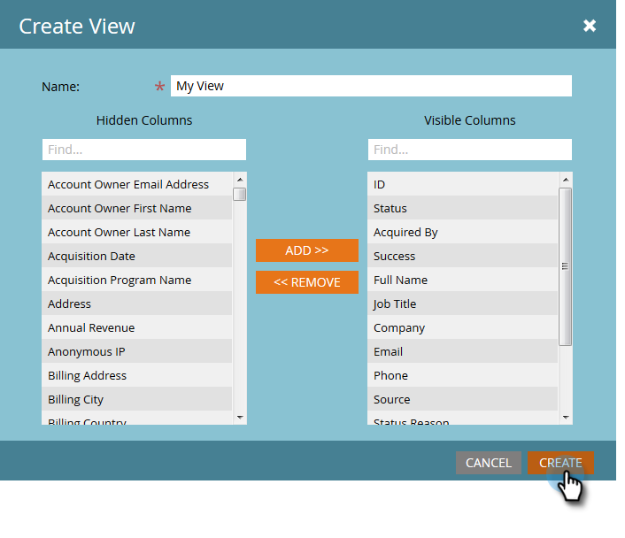

# Verwalten und Anzeigen von Mitgliedern {#manage-and-view-members}

Sie können Ihre Mitglieder in Ihren Programmen über die Registerkarte Mitglieder verwalten und anzeigen.

>[!NOTE]
>
>Tauchen Sie tiefer in [Programmmitgliedschaft](/help/marketo/product-docs/core-marketo-concepts/programs/creating-programs/understanding-program-membership.md){target="_blank"} ein.

## Mitglied suchen {#search-for-a-member}

Verwenden Sie das Suchfeld unten im Abschnitt Mitglieder , um nach Programmmitgliedern anhand von Name, E-Mail-Adresse, Stellenbezeichnung oder Firma zu suchen.

1. Klicken Sie auf **[!UICONTROL Registerkarte]** Mitglieder“ Ihres Programms.

   

1. Verwenden Sie das Suchfeld, um die Liste der Mitglieder zu durchsuchen.

   

## Exportieren des Mitgliederrasters {#export-the-members-grid}

Sie können Ihre Mitgliederliste exportieren, indem Sie auf das [!DNL Excel] neben dem Suchfeld klicken.

## Verwalten von Spalten im Mitgliederraster {#manage-columns-in-the-members-grid}

Spalten per Drag-and-Drop verschieben, um ihre Reihenfolge zu ändern. Das blaue Pfeilpaar gibt an, wohin die Spalte gehen soll.

Klicken Sie mit der rechten Maustaste auf die Spaltenüberschrift, um eine alphabetische Sortierung auf- oder absteigend vorzunehmen.

## Wählen Sie aus, welche Spalten im Raster sichtbar sind {#choose-which-columns-are-visible-in-the-grid}

1. Klicken Sie auf **[!UICONTROL Ansicht]** und wählen Sie **[!UICONTROL Ansicht erstellen]** aus.

   

1. Benennen Sie Ihre benutzerdefinierte Ansicht. Spaltentitel auswählen. Klicken Sie auf **[!UICONTROL Hinzufügen]** und **[!UICONTROL Entfernen]**, um Spalten zu verschieben und eine Ansicht zu erstellen.

   

1. Klicken Sie auf **[!UICONTROL Erstellen]**.

   

## Filtern des Mitgliederrasters  {#filter-the-members-grid}

1. Klicken Sie auf **[!UICONTROL Filter]** und wählen Sie einen Progressionsschritt aus, nach dem sortiert werden soll.

   

## Verwalten des Personenstatus im Mitgliederraster {#manage-person-status-in-the-members-grid}

Sie können den Status Ihrer Personen im Mitgliederraster ändern.

1. Halten Sie **[!UICONTROL Strg/Befehl]** gedrückt und wählen Sie die Personen aus.

   

1. Klicken Sie auf **[!UICONTROL Status ändern]** und wählen Sie einen Status aus.

   

   Dies kann einen Moment dauern. Wenn alles erledigt ist, sehen Sie die unten stehende Nachricht!

   

Es gibt so viele Funktionen, aber die sind alle ziemlich unkompliziert. Viel Spaß!

>[!MORELIKETHIS]
>
>[Erstellen eines Programmleistungsberichts](/help/marketo/product-docs/core-marketo-concepts/programs/program-performance-report/create-a-program-performance-report.md){target="_blank"}
