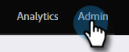

# Benutzerdefinierte Feldsynchronisierung zwischen Programmteilnehmern {#program-member-custom-field-sync}

>[!PREREQUISITES]
>
>* Erstellung [Benutzerdefinierte Felder für Programmmitglieder](/help/marketo/product-docs/core-marketo-concepts/programs/working-with-programs/program-member-custom-fields.md){target="_blank"}
>* [Salesforce-Kampagne mit einem Programm synchronisieren](/help/marketo/product-docs/core-marketo-concepts/programs/working-with-programs/sync-an-sfdc-campaign-with-a-program.md){target="_blank"}

>[!NOTE]
>
>Das Programmteilobjekt kann über bis zu 20 benutzerdefinierte Felder verfügen. Diese Felder stehen jedem Programm zur Verfügung.

## Salesforce-Felder benutzerdefinierten Feldern des Programmmitglieds zuordnen {#map-salesforce-fields-to-program-member-custom-fields}

1. Klicken Sie in Marketo auf **[!UICONTROL Admin]**.

   

1. Klicks **[!DNL Salesforce]** Klicken Sie auf **[!UICONTROL Bearbeiten]** neben Benutzerdefinierte Feldsynchronisierung für Programmmitglieder.

   

1. Verwenden Sie das Suchfeld, um die Salesforce-Felder zu finden, die Sie zuordnen möchten. In diesem Beispiel verwenden wir &quot;Do Not Call&quot;.

   

1. Klicken Sie auf die Dropdown-Liste.

   

1. Wählen Sie das gewünschte benutzerdefinierte Feld für Marketo-Programmteilnehmer aus, das zugeordnet werden soll.

   

   >[!NOTE]
   >
   >In der Dropdown-Liste werden nur benutzerdefinierte Felder für Programmmitglieder angezeigt, die dem Datentyp des Salesforce-Felds entsprechen.

1. Für weitere Feldzuordnungen deaktivieren Sie das Suchfeld und wiederholen Sie die Schritte 3 bis 5.

1. Klicks **[!UICONTROL Speichern]** wann geschehen.

   

   >[!IMPORTANT]
   >
   >Änderungen an den Programmmitgliedern in den zugeordneten Feldern werden künftig zwischen Marketo und Salesforce synchronisiert.

   >[!NOTE]
   >
   >Wenn Sie den Datentyp eines Felds in Salesforce umbenennen oder ändern, wird jede Zuordnung dieses Felds zum benutzerdefinierten Feld &quot;Programmteilnehmer&quot;entfernt. Sie können es jedoch nach der Überprüfung mit dem neuen Feld überarbeiten.

## Salesforce-Felder aus benutzerdefinierten Feldern des Programmmitglieds aufheben {#unmap-salesforce-fields-from-program-member-custom-fields}

Wenn Sie ein Feld freigeben möchten, um es zu ersetzen, oder einfach eine allgemeine Änderung vornehmen möchten, müssen Sie zuerst eine Aufhebung der Zuordnung durchführen. So geht es.

1. Klicken Sie in Marketo auf **[!UICONTROL Admin]**.

   

1. Klicks **[!DNL Salesforce]** Klicken Sie auf **[!UICONTROL Bearbeiten]** neben Benutzerdefinierte Feldsynchronisierung für Programmmitglieder.

   

1. Verwenden Sie das Suchfeld, um die Felder zu finden, deren Zuordnung Sie aufheben möchten. In diesem Beispiel verwenden wir &quot;Do Not Call&quot;.

   

   >[!TIP]
   >
   >Sie können die **[!UICONTROL Zugeordnet]** aktivieren, um nur zugeordnete Felder anzuzeigen.

1. Aufheben der Zuordnung durch Klicken auf **X** neben dem Feld.

   

1. Die Zuordnung wurde entfernt. Klicken Sie auf **[!UICONTROL Speichern]**.

   

## Datentypzuordnung {#data-type-mapping}

<table>
  <colgroup>
    <col/>
    <col/>
  </colgroup>
  <tbody>
    <tr>
      <th>SFDC-Datentyp</th>
      <th>Benutzerdefinierter Felddatentyp für Programmteilnehmer</th>
    </tr>
    <tr>
      <td>Text</td>
      <td>Zeichenfolge</td>
    </tr>
    <tr>
      <td>Auswahlliste</td>
      <td>Zeichenfolge</td>
    </tr>
    <tr>
      <td>Mehrfachauswahl-Auswahlliste</td>
      <td>Zeichenfolge</td>
    </tr>
    <tr>
      <td>Telefon</td>
      <td>Zeichenfolge</td>
    </tr>
    <tr>
      <td>E-Mail</td>
      <td>Zeichenfolge</td>
    </tr>
    <tr>
      <td>Anzahl(m)</td>
      <td>Ganzzahl</td>
    </tr>
    <tr>
      <td>Number(m,n)</td>
      <td>Fließkommazahl</td>
    </tr>
    <tr>
      <td>Kontrollkästchen</td>
      <td>Boolesch</td>
    </tr>
    <tr>
      <td>URL</td>
      <td>URL</td>
    </tr>
    <tr>
      <td>Datum</td>
      <td>Datum</td>
    </tr>
    <tr>
      <td>Datum/Uhrzeit</td>
      <td>Datum/Uhrzeit</td>
    </tr>
    <tr>
      <td>Suche (Referenz)</td>
      <td>Zeichenfolge</td>
    </tr>
    <tr>
      <td>Base64</td>
      <td>Zeichenfolge</td>
    </tr>
  </tbody>
</table>

>[!MORELIKETHIS]
>
>* [Programmmitgliedsdaten ändern](/help/marketo/product-docs/core-marketo-concepts/smart-campaigns/program-flow-actions/change-program-member-data.md){target="_blank"}
>* [Daten im Programmteilernetz anzeigen](/help/marketo/product-docs/core-marketo-concepts/programs/working-with-programs/manage-and-view-members.md){target="_blank"}
>* [SFDC Sync - Kampagnensynchronisierung](/help/marketo/product-docs/crm-sync/salesforce-sync/sfdc-sync-details/sfdc-sync-campaign-sync.md){target="_blank"}
