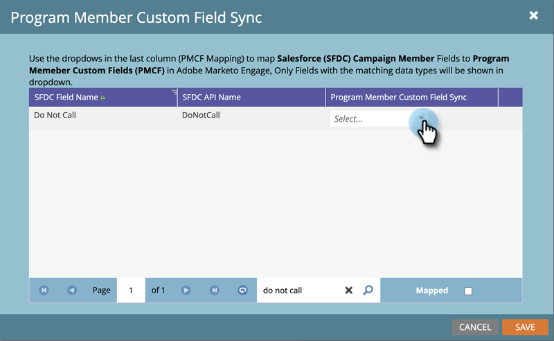

# Synchronisierung benutzerdefinierter Felder für Programmmitglieder {#program-member-custom-field-sync}

>[!PREREQUISITES]
>
>* Erstellung [ benutzerdefinierten Felder für Programmteilnehmer](/help/marketo/product-docs/core-marketo-concepts/programs/working-with-programs/program-member-custom-fields.md){target="_blank"}
>* [Synchronisieren einer Salesforce-Kampagne mit einem Programm](/help/marketo/product-docs/core-marketo-concepts/programs/working-with-programs/sync-an-sfdc-campaign-with-a-program.md){target="_blank"}

>[!NOTE]
>
>Das Objekt Programmteilnehmer kann bis zu 20 benutzerdefinierte Felder enthalten. Diese Felder stehen jedem Programm zur Verfügung.

## Zuordnen von Salesforce-Feldern zu benutzerdefinierten Feldern für Programmteilnehmer {#map-salesforce-fields-to-program-member-custom-fields}

1. Klicken Sie in Marketo auf **[!UICONTROL Admin]**.

   

1. Klicken Sie auf **[!DNL Salesforce]** und dann auf **[!UICONTROL Bearbeiten]** neben „Programmteilnehmer - Benutzerdefiniertes Feld synchronisieren“.

   

1. Verwenden Sie das Suchfeld, um die Salesforce-Felder zu finden, die Sie zuordnen möchten. In diesem Beispiel verwenden wir „Nicht aufrufen“.

   

1. Klicken Sie auf die Dropdown-Liste.

   

1. Wählen Sie das gewünschte benutzerdefinierte Feld für Marketo-Programmteilnehmer aus, das zugeordnet werden soll.

   

   >[!NOTE]
   >
   >In der Dropdown-Liste werden nur benutzerdefinierte Felder für Programmmitglieder angezeigt, die dem Datentyp des Salesforce-Felds entsprechen.

1. Deaktivieren Sie für zusätzliche Feldzuordnungen das Suchfeld und wiederholen Sie die Schritte 3 bis 5.

1. Klicken Sie auf **[!UICONTROL Speichern]**, wenn Sie fertig sind.

   

   >[!IMPORTANT]
   >
   >Änderungen an den Programmmitgliedsdaten in den zugeordneten Feldern werden künftig zwischen Marketo und Salesforce synchronisiert.

   >[!NOTE]
   >
   >Wenn Sie den Datentyp eines Felds in Salesforce umbenennen oder ändern, entfernen wir jede Zuordnung dieses Felds zum benutzerdefinierten Feld „Programmteilnehmer“. Sie können sie jedoch nach der Überprüfung dem neuen Feld zuordnen.

## Zuordnung von Salesforce-Feldern zu benutzerdefinierten Programmteilnehmerfeldern aufheben {#unmap-salesforce-fields-from-program-member-custom-fields}

Wenn Sie ein Feld freigeben möchten, um es zu ersetzen, oder nur eine allgemeine Änderung vornehmen möchten, müssen Sie zuerst eine Aufhebung der Zuordnung durchführen. So geht&#39;s.

1. Klicken Sie in Marketo auf **[!UICONTROL Admin]**.

   

1. Klicken Sie auf **[!DNL Salesforce]** und dann auf **[!UICONTROL Bearbeiten]** neben „Programmteilnehmer - Benutzerdefiniertes Feld synchronisieren“.

   

1. Verwenden Sie das Suchfeld, um die Felder zu suchen, deren Zuordnung Sie aufheben möchten. In diesem Beispiel verwenden wir „Nicht aufrufen“.

   

   >[!TIP]
   >
   >Sie können das Kontrollkästchen **[!UICONTROL Zugeordnet]** aktivieren, um nur zugeordnete Felder anzuzeigen.

1. Heben Sie die Zuordnung auf, indem Sie auf **X** neben dem Feld klicken.

   

1. Die Zuordnung wird jetzt entfernt. Klicken Sie auf **[!UICONTROL Speichern]**.

   

## Datentypzuordnung {#data-type-mapping}

<table>
  <colgroup>
    <col/>
    <col/>
  </colgroup>
  <tbody>
    <tr>
      <th>SFDC-Datentyp</th>
      <th>Datentyp des benutzerdefinierten Feldes des Programmmitglieds</th>
    </tr>
    <tr>
      <td>Text</td>
      <td>String</td>
    </tr>
    <tr>
      <td>Auswahlliste</td>
      <td>String</td>
    </tr>
    <tr>
      <td>Auswahlliste mit Mehrfachauswahl</td>
      <td>String</td>
    </tr>
    <tr>
      <td>Telefon</td>
      <td>String</td>
    </tr>
    <tr>
      <td>E-Mail</td>
      <td>String</td>
    </tr>
    <tr>
      <td>Zahl(m)</td>
      <td>Ganzzahl</td>
    </tr>
    <tr>
      <td>Zahl (m,n)</td>
      <td>Gleitkomma</td>
    </tr>
    <tr>
      <td>Kontrollkästchen</td>
      <td>Boolesch</td>
    </tr>
    <tr>
      <td>URL</td>
      <td>URL</td>
    </tr>
    <tr>
      <td>Datum</td>
      <td>Datum</td>
    </tr>
    <tr>
      <td>Datum/Uhrzeit</td>
      <td>Datum/Uhrzeit</td>
    </tr>
    <tr>
      <td>Lookup (Referenz)</td>
      <td>String</td>
    </tr>
    <tr>
      <td>Base64</td>
      <td>String</td>
    </tr>
  </tbody>
</table>

>[!MORELIKETHIS]
>
>* [Ändern der Daten von Programmmitgliedern](/help/marketo/product-docs/core-marketo-concepts/smart-campaigns/program-flow-actions/change-program-member-data.md){target="_blank"}
>* [Zeigen Sie Daten im Raster „Programmteilnehmer“ an](/help/marketo/product-docs/core-marketo-concepts/programs/working-with-programs/manage-and-view-members.md){target="_blank"}
>* [SFDC-Synchronisierung - Kampagnensynchronisierung](/help/marketo/product-docs/crm-sync/salesforce-sync/sfdc-sync-details/sfdc-sync-campaign-sync.md){target="_blank"}
