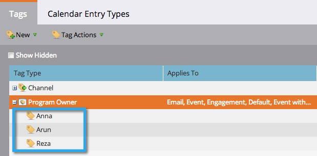
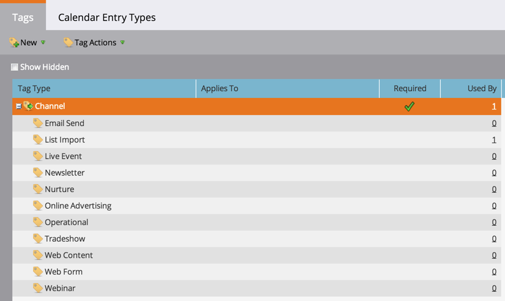

# Grundlegendes zu Tags {#understanding-tags}

Inzwischen wissen Sie wahrscheinlich, dass Programme wie Bausteine in Marketo Engage sind. Die Verwendung von Tags und Kanälen hilft Ihnen beim Filtern von Daten zu Berichtszwecken.

Tags werden verwendet, um Programme zu beschreiben. Sie können beliebig viele davon mit jeweils eindeutigen Werten erstellen. Die Kanäle identifizieren den Bereitstellungsmechanismus in einem Programm, z. B. Webinar, Sponsoring oder Online-Anzeige.

## Tag-Typ {#tag-type}

Tag-Typen identifizieren die Art von Informationen, nach denen Sie sortieren möchten.

>[!TIP]
>
>Wenden Sie sich an Ihren Marketo-Administrator, wenn Sie &quot;[&#x200B; Tags“ erstellen &#x200B;](/help/marketo/product-docs/administration/tags/create-custom-tags.md){target="_blank"}.

>[!NOTE]
>
>**Beispiel**
>
>* [!UICONTROL Tag Type] = Programm-Inhaber

## Tag-Wert {#tag-value}

Jeder Tag-Typ verfügt über Werte zur Auswahl.

>[!NOTE]
>
>**Beispiel**
>
>* Tag-Werte = Anna, Arun, Reza

## Kanal {#channel}

Kanäle werden verwendet, um zu berichten, wie Ihre [Mitglieder](/help/marketo/product-docs/core-marketo-concepts/programs/creating-programs/understanding-program-membership.md){target="_blank"} Ihr Programm durchlaufen haben. Jeder Kanal verfügt über eine Reihe von Fortschrittsstatus und einen Status, der auf „Gleicher Erfolg“ eingestellt ist.

>[!NOTE]
>
>**Beispiel**
>
>* Kanal = Roadshow
>* Fortschrittsstatus = Eingeladen, Registriert, Teilgenommen, Nicht angezeigt
>* Erfolg = Teilgenommen

>[!MORELIKETHIS]
>
>* [Erstellen benutzerdefinierter Tags](/help/marketo/product-docs/administration/tags/create-custom-tags.md){target="_blank"}
>* [Erstellen eines Programmkanals](/help/marketo/product-docs/administration/tags/create-a-program-channel.md){target="_blank"}
