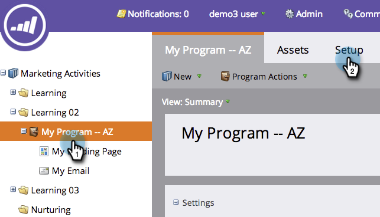

# Tags in einem Programm verwenden {#use-tags-in-a-program}

Tags sind Attribute, die Ihre Programm beschreiben und zur Gruppierung von Programm-Typen in Berichte verwendet werden.

## Tag in einem Programm verwenden {#use-a-tag-in-a-program}

1. Wählen Sie Ihr Programm aus. Klicken Sie auf **Setup**.

   

1. Ziehen Sie ein Tag per Drag &amp; Drop in die Arbeitsfläche.

   

1. Wählen Sie einen Wert aus der Dropdownliste.

   

1. Klicken Sie auf **Speichern**.

   

1. Gleich. Sie sehen das neue Tag auf der Arbeitsfläche.

   

## Tag bearbeiten {#edit-a-tag}

1. Gehen Sie zur Registerkarte **Einstellungen** . Klicken Sie mit der rechten Maustaste auf das Tag. Wählen Sie **Bearbeiten**.

   

1. Klicken Sie auf die Dropdownliste. Wählen Sie einen neuen Wert.

   

1. Klicken Sie auf **Speichern**.

   

1. Großartig! Die Änderungen sollten auf der Arbeitsfläche angezeigt werden.

   

## Tag löschen  {#delete-a-tag}

1. Gehen Sie zur Registerkarte **Einstellungen** . Klicken Sie mit der rechten Maustaste auf das Tag und wählen Sie **Löschen**.

   

1. Klicken Sie zur Bestätigung auf **Löschen*.

   

Hoch fünf! Es ist weg. Programm mit konsistenten Tags vereinfachen die Ausführung Ihrer Berichte erheblich.
