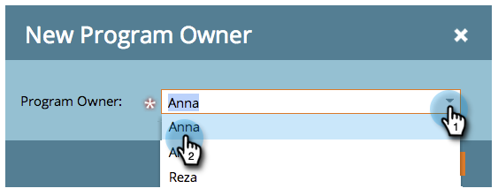
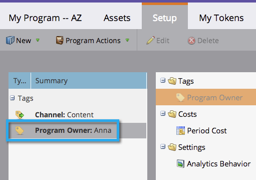

# Verwenden von Tags in einem Programm {#use-tags-in-a-program}

Tags sind Attribute, die Ihre Programme beschreiben und zum Gruppieren von Programmtypen in Berichten verwendet werden.

>[!NOTE]
>
>Wenn Sie den Umsatzzyklus-Explorer verwenden, müssen Periodenkosten definiert werden (selbst wenn sie bei 0 liegen), damit Berichte für das Programm verfügbar sind.

## Verwenden eines Tags in einem Programm {#use-a-tag-in-a-program}

1. Wählen Sie Ihr Programm. Klicken Sie **[!UICONTROL Setup]**.

   

1. Ziehen Sie ein Tag auf die Arbeitsfläche.

   

1. Wählen Sie einen Wert aus der Dropdownliste aus.

   

1. Klicken Sie auf **[!UICONTROL Speichern]**.

   

1. Gleich. Sie sehen das neue Tag auf der Arbeitsfläche.

   

## Tag bearbeiten {#edit-a-tag}

1. Wechseln Sie zur Registerkarte **[!UICONTROL Setup]**. Klicken Sie mit der rechten Maustaste auf das Tag. Wählen Sie **[!UICONTROL Bearbeiten]** aus.

   

1. Klicken Sie auf die Dropdown-Liste. Einen neuen Wert auswählen.

   

1. Klicken Sie auf **[!UICONTROL Speichern]**.

   

1. Sehr gut! Die Bearbeitungen sollten auf der Arbeitsfläche sichtbar sein.

   

## Löschen eines Tags  {#delete-a-tag}

1. Wechseln Sie zur Registerkarte **[!UICONTROL Setup]**. Klicken Sie mit der rechten Maustaste auf das Tag und wählen Sie **[!UICONTROL Löschen]**.

   

1. Klicken Sie **[!UICONTROL Löschen]** zur Bestätigung.

   

Gut gemacht! Programme mit konsistenten Tags erleichtern das Ausführen von Berichten erheblich.
