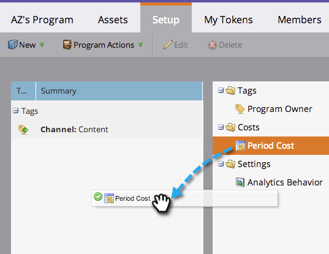

# Verwenden von Zeitraumkosten in einem Programm {#using-period-costs-in-a-program}

A [Zeitraumkosten](/help/marketo/product-docs/core-marketo-concepts/programs/working-with-programs/understanding-period-costs.md){target="_blank"} ist der Betrag, den Sie für ein Programm ausgeben. Er kann einen oder mehrere Monate dauern und wird für die Berichterstellung des ROI verwendet.

## Hinzufügen von Periodenkosten  {#add-a-period-cost}

1. Navigieren Sie zu **[!UICONTROL Einrichtung]** -Tab Ihres Programms.

   

1. Drag &amp; Drop **[!UICONTROL Periodenkosten]** in die Arbeitsfläche.

   

1. Klicken Sie auf das Kalendersymbol. Einen Monat auswählen. Klicks **[!UICONTROL OK]**.

   

1. Geben Sie einen **[!UICONTROL Periodenkosten]** (ohne Dezimalstellen oder Kommas). Klicken Sie auf **[!UICONTROL Speichern]**.

   >[!NOTE]
   >
   >Dies kann eine Schätzung sein. Sobald Sie den genauen Betrag kennen, können Sie die Kosten eines Zeitraums jederzeit bearbeiten (siehe nächsten Abschnitt).

   

1. Die Kosten werden im Programm angezeigt.

   

   >[!TIP]
   >
   >Sie können mehrere Zeitraumkosten per Drag-and-Drop auf die Arbeitsfläche ziehen. Auf diese Weise können Sie Ihrem Programm mehrere Monate mit unterschiedlichen Zeitraumkosten zuordnen.

## Bearbeiten von Periodenkosten {#edit-a-period-cost}

1. Wenn Sie mehr oder weniger Geld ausgeben als ursprünglich geplant, können Sie die Zeitraumkosten bearbeiten.

1. Navigieren Sie zu **[!UICONTROL Einrichtung]** -Tab Ihres Programms.

   

1. Rechtsklicken Sie auf die **[!UICONTROL Periodenkosten]**. Auswählen **[!UICONTROL Bearbeiten]**.

   

1. Nehmen Sie Ihre Änderungen vor. Klicken Sie auf **[!UICONTROL Speichern]**.

   

## Löschen von Zeitkosten {#delete-a-period-cost}

1. Navigieren Sie zu **[!UICONTROL Einrichtung]** -Tab Ihres Programms.

   

1. Rechtsklicken Sie auf die **[!UICONTROL Periodenkosten]**. Auswählen **[!UICONTROL Löschen]**.

   

1. Klicks **[!UICONTROL Löschen]** zur Bestätigung.

   

>[!MORELIKETHIS]
>
>* [Zeitkosten verstehen](/help/marketo/product-docs/core-marketo-concepts/programs/working-with-programs/understanding-period-costs.md){target="_blank"}
>* [Filtern eines Programmberichts nach Periodenkosten](/help/marketo/product-docs/core-marketo-concepts/programs/program-performance-report/filter-a-program-report-by-period-cost.md){target="_blank"}
