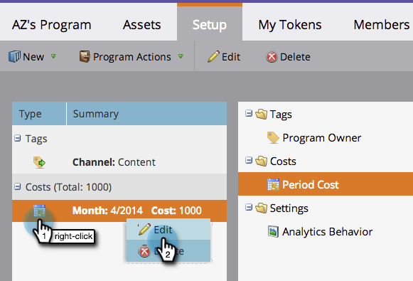

# Verwenden von Periodenkosten in einem Programm {#using-period-costs-in-a-program}

Ein [Zeitraum](understanding-period-costs.md) ist der Betrag, den Sie für ein Programm ausgeben. Es kann ein oder mehrere Monate dauern und wird für den Berichte-ROI verwendet.

>[!NOTE]
>
>**Tieftauchen**
>
> Erfahren Sie mehr über [Umsatz in Analytics](http://docs.marketo.com/display/docs/revenue+cycle+analytics).

## hinzufügen  {#add-a-period-cost}

1. Gehen Sie zur Registerkarte **Einstellungen** Ihres Programms.

   

1. Ziehen Sie die **Zeitkosten** per Drag &amp; Drop in die Arbeitsfläche.

   

1. Klicken Sie auf das Kalendersymbol. Wählen Sie einen Monat aus. Klicken Sie auf **OK**.

   

1. Geben Sie eine **Period-Kosten** ein (ohne Dezimalstellen oder Kommas). Klicken Sie auf **Speichern**.

   >[!NOTE]
   >
   >Das kann eine Schätzung sein. Sie können die Kosten eines Zeitraums jederzeit bearbeiten, sobald Sie den genauen Betrag kennen (siehe nächsten Abschnitt).

   

1. Die Kosten werden im Programm angezeigt.

   

   >[!TIP]
   >
   >Sie können mehrere Zeitraumkosten per Drag &amp; Drop auf die Arbeitsfläche ziehen. Dadurch können Sie Ihrem Programm mehrere Monate mit unterschiedlichen Periodenkosten zuordnen.

## Bearbeiten von Zeitkosten {#edit-a-period-cost}

1. Wenn Sie mehr oder weniger Geld ausgeben als ursprünglich geplant, können Sie die Zeitraumkosten bearbeiten.
1. Gehen Sie zur Registerkarte **Setup **Ihres Programms.

   

1. Klicken Sie mit der rechten Maustaste auf die **Periodenkosten**. Wählen Sie **Bearbeiten**.

   

1. Nehmen Sie Ihre Änderungen vor. Klicken Sie auf **Speichern**.

   

## Löschen von Zeitkosten {#delete-a-period-cost}

1. Gehen Sie zur Registerkarte **Einstellungen** Ihres Programms.

   

1. Klicken Sie mit der rechten Maustaste auf die **Periodenkosten**. Wählen Sie **Löschen**.

   

1. Klicken Sie zur Bestätigung auf **Löschen*.

   

>[!NOTE]
>
>**Verwandte Artikel**
>
>* [Die Kosten des Zeitraums](understanding-period-costs.md)
>* [Umsatzzyklusanalysen](http://docs.marketo.com/display/docs/revenue+cycle+analytics)
>* [Filtern eines Programm-Berichts nach Zeitraumkosten](../../../../product-docs/core-marketo-concepts/programs/program-performance-report/filter-a-program-report-by-period-cost.md)

>

