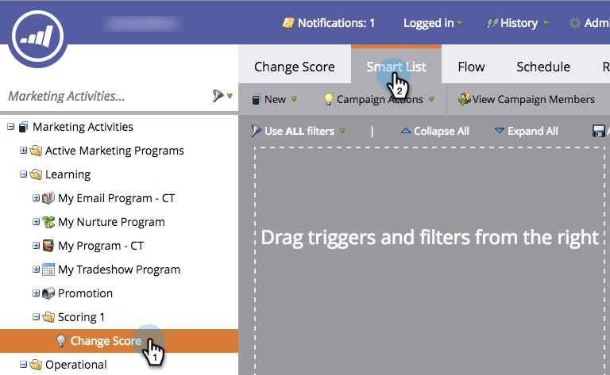
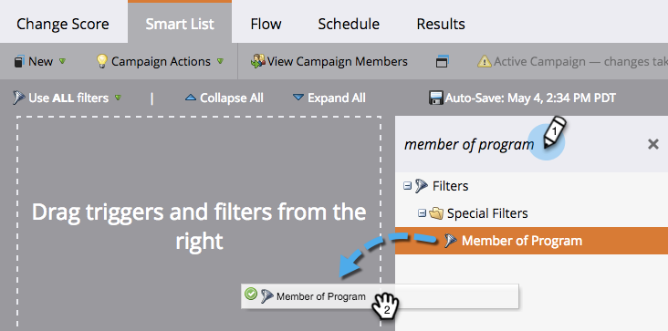
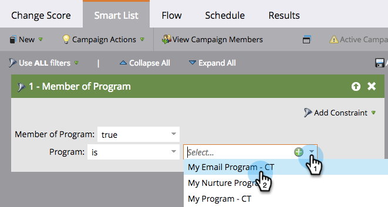

# Intelligente Liste für intelligente Kampagne definieren | Stapel {#define-smart-list-for-smart-campaign-batch}

Intelligente Listen sind der Mechanismus, mit dem in ganz Marketo &quot;wer&quot;(welche Personen) definiert werden soll, ob es sich um einen Bericht, eine Liste oder eine intelligente Kampagne handelt. So definieren Sie eine intelligente Liste für eine Batch-Kampagne.

1. Wählen Sie eine intelligente Kampagne und klicken Sie dann auf **Intelligente Liste**.

   

1. Geben Sie ein, um nach einem Filter zu suchen, und ziehen Sie ihn per Drag &amp; Drop auf die Arbeitsfläche. Wiederholen Sie diese Schritte für mehrere Filter.

   

   >[!NOTE]
   >
   >Eine intelligente Kampagne mit nur Filtern wird im **Stapelmodus** ausgeführt. Es findet Personen in der Datenbank, die sich auf Grundlage der Filter qualifizieren, und führt sie alle gleichzeitig durch den Fluss.

   >[!NOTE]
   >
   >**Erinnerung**
   >
   >
   >Sie können eine intelligente Kampagne basierend auf Live-Ereignissen einzeln ausführen, indem Sie Auslöser hinzufügen, wodurch die intelligente Kampagne im **Auslösermodus** ausgeführt wird.

1. Klicken Sie auf die Dropdownliste und wählen Sie einen Filteroperator für den ausgewählten Filter.

   

   >[!CAUTION]
   >
   >Rote, zitternde Linien weisen auf Fehler oder fehlende Informationen hin. Wenn die Kampagne nicht korrigiert wird, ist sie ungültig und wird nicht ausgeführt.

1. Geben Sie den Filterwert ein.

   

   >[!NOTE]
   >
   >Standardmäßig sind Personen, die ALLE Regeln der intelligenten Liste erfüllen, qualifiziert. Dies kann an Ihre Kampagne angepasst werden. Weitere Informationen finden Sie unter [Intelligente Listen für komplexe Logik](../../../../product-docs/core-marketo-concepts/smart-lists-and-static-lists/using-smart-lists/using-advanced-smart-list-rule-logic.md) .

   So aktivieren Sie die Option &quot;Intelligente Liste für intelligente Kampagne [definieren&quot; | Auslöser](define-smart-list-for-smart-campaign-trigger.md).

   >[!NOTE]
   >
   >**Verwandte Artikel**
   >
   >    
   >    
   >    * [Intelligente Liste für intelligente Kampagne definieren | Auslöser](define-smart-list-for-smart-campaign-trigger.md)
   >    * [hinzufügen eines Flussschritts zu einer intelligenten Kampagne](../../../../product-docs/core-marketo-concepts/smart-campaigns/flow-actions/add-a-flow-step-to-a-smart-campaign.md)

