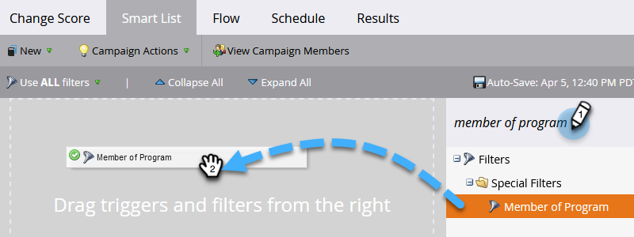

# Smart-Liste für Smart-Kampagnen definieren | Batch {#define-smart-list-for-smart-campaign-batch}

Smart Lists sind in Marketo Engage der Mechanismus, mit dem definiert wird, „wer“ (welche Personen) einbezogen werden soll, unabhängig davon, ob es sich um einen Bericht, eine Liste oder eine Smart Campaign handelt. So definieren Sie eine Smart-Liste für eine Batch-Kampagne.

>[!CAUTION]
>
>Die Bearbeitung von Smart List- oder Flow Step-Elementen an einer aktiven Kampagne kann deren Funktionalität beeinträchtigen. Wenn Sie sich dafür entscheiden, gehen Sie mit Vorsicht vor.

1. Wählen Sie eine Smart-Kampagne aus und klicken Sie dann auf **[!UICONTROL Smart-Liste]**.

   

1. Tippen Sie, um nach einem Filter zu suchen und ihn per Drag-and-Drop auf die Arbeitsfläche zu ziehen. Wiederholen Sie dies für mehrere Filter.

   

   >[!NOTE]
   >
   >Eine Smart Campaign mit nur Filtern wird im _Batch_-Modus ausgeführt. Er findet Personen in der Datenbank, die sich anhand der Filter qualifizieren, und führt alle gleichzeitig durch den Fluss.

   >[!NOTE]
   >
   >Sie können eine Smart-Kampagne auf der Grundlage von Live-Ereignissen einzeln ausführen lassen, indem Sie Trigger hinzufügen. Dadurch wird die Smart-Kampagne in den Trigger __ versetzt.

1. Klicken Sie auf das Dropdown-Menü und wählen Sie einen Filteroperator für den ausgewählten Filter.

   

   >[!CAUTION]
   >
   >Rote schielende Linien zeigen Fehler oder fehlende Informationen an. Wenn die Kampagne nicht korrigiert wird, ist sie ungültig und wird nicht ausgeführt.

1. Geben Sie den Filterwert ein.

   

   >[!NOTE]
   >
   >Standardmäßig sind Personen qualifiziert, die ALLE Regeln der Smart-Liste erfüllen. Dies kann Ihren Kampagnenanforderungen entsprechend geändert werden. Weitere Informationen finden [ unter „Regeln für intelligente Listen ](/help/marketo/product-docs/core-marketo-concepts/smart-lists-and-static-lists/using-smart-lists/using-advanced-smart-list-rule-logic.md){target="_blank"} komplexe Logik“.

   Um Trigger zu Live-Ereignissen einzeln durchzuführen, erfahren Sie, wie Sie [ Smart-Liste für Smart-Kampagnen definieren | Trigger ](/help/marketo/product-docs/core-marketo-concepts/smart-campaigns/creating-a-smart-campaign/define-smart-list-for-smart-campaign-trigger.md){target="_blank"}.

   >[!MORELIKETHIS]
   >
   >* [Definieren der Smart-Liste für intelligente Kampagnen | Trigger ](/help/marketo/product-docs/core-marketo-concepts/smart-campaigns/creating-a-smart-campaign/define-smart-list-for-smart-campaign-trigger.md){target="_blank"}
   >* [Hinzufügen eines Flussschritts zu einer Smart-Kampagne](/help/marketo/product-docs/core-marketo-concepts/smart-campaigns/flow-actions/add-a-flow-step-to-a-smart-campaign.md){target="_blank"}
