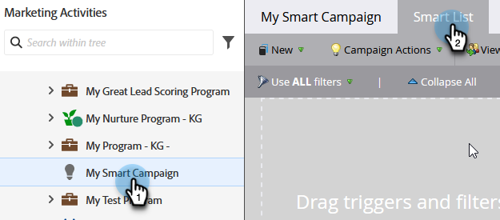

# Definieren einer intelligenten Liste für eine intelligente Kampagne | Auslöser {#define-smart-list-for-smart-campaign-trigger}

Erstellen Sie durch Hinzufügen von Triggern, dass eine Smart-Kampagne basierend auf Live-Ereignissen jeweils nur für eine Person ausgeführt wird.

>[!CAUTION]
>
>Die Bearbeitung von Smart List- oder Flow Step-Elementen an einer aktiven Kampagne kann deren Funktionalität beeinträchtigen. Wenn Sie sich dafür entscheiden, gehen Sie mit Vorsicht vor.

1. Klicken Sie in Ihrer Smart-Kampagne auf die **[!UICONTROL Smart-Liste]**.

   

1. Suchen Sie nach dem gewünschten Trigger und ziehen Sie ihn per Drag-and-Drop auf die Arbeitsfläche.

   

   >[!NOTE]
   >
   >Eine Smart-Kampagne mit Triggern wird im Trigger __ ausgeführt. Er wird jeweils nur für eine Person ausgeführt, basierend auf ausgelösten Ereignissen und zusätzlichen Filtern.

   >[!IMPORTANT]
   >
   >Bei Verwendung eines booleschen Felds in einer Smart List einer Trigger-Kampagne müssen Sie es explizit auf „false“ setzen, damit das Feld während der Ausführung der Kampagne ordnungsgemäß ausgewertet wird.

1. Klicken Sie auf das Dropdown-Menü und wählen Sie einen Operator aus.

   

   >[!CAUTION]
   >
   >Rote schielende Linien zeigen Fehler oder fehlende Informationen an. Wenn die Kampagne nicht korrigiert wird, ist sie ungültig und wird nicht ausgeführt.

   >[!TIP]
   >
   >In einer Smart-Kampagne mit Triggern und Filtern werden die Trigger oben angezeigt. Wenn sie ausgelöst werden, durchlaufen nur Personen den Fluss, die die Filterkriterien erfüllen.

1. Definieren Sie den Trigger.

   

   >[!NOTE]
   >
   >Bei mehreren Triggern durchläuft eine Person den Fluss, wenn _BELIEBIG_ einer der Trigger aktiviert wird.

Wenn Sie die Kampagne für mehrere Personen gleichzeitig ausführen möchten, erfahren Sie hier, wie Sie [Smart-Liste für Smart-Kampagnen definieren | Batch](/help/marketo/product-docs/core-marketo-concepts/smart-campaigns/creating-a-smart-campaign/define-smart-list-for-smart-campaign-batch.md){target="_blank"}.

>[!MORELIKETHIS]
>
>[Hinzufügen eines Flussschritts zu einer Smart-Kampagne](/help/marketo/product-docs/core-marketo-concepts/smart-campaigns/flow-actions/add-a-flow-step-to-a-smart-campaign.md){target="_blank"}
