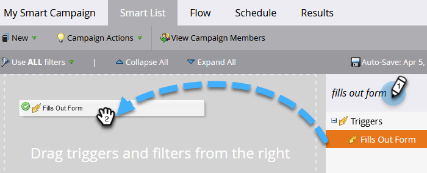

# Definieren einer Smart-Liste für eine intelligente Kampagne | TRIGGER {#define-smart-list-for-smart-campaign-trigger}

Erstellen Sie basierend auf Live-Ereignissen eine Smart-Kampagne für eine Person, indem Sie Trigger hinzufügen.

1. Klicken Sie in Ihrer Smart-Kampagne auf die **Smart List** Registerkarte.

   

1. Suchen Sie nach dem gewünschten Trigger und ziehen Sie ihn per Drag-and-Drop auf die Arbeitsfläche.

   

   >[!NOTE]
   >
   >Eine Smart-Kampagne mit Triggern wird in **Trigger** -Modus. Er wird basierend auf ausgelösten Ereignissen und beliebigen zusätzlichen Filtern jeweils für eine Person ausgeführt.

   >[!IMPORTANT]
   >
   >Wenn Sie ein boolesches Feld in einer Trigger-Kampagnen-Smart-Liste verwenden, müssen Sie es explizit auf &quot;false&quot;setzen, damit das Feld während der Ausführung der Kampagne korrekt ausgewertet wird.

1. Klicken Sie auf die Dropdown-Liste und wählen Sie einen Operator aus.

   

   >[!CAUTION]
   >
   >Rote eckige Linien zeigen Fehler oder fehlende Informationen an. Wenn die Kampagne nicht korrigiert wird, ist sie ungültig und wird nicht ausgeführt.

   >[!TIP]
   >
   >In einer Smart-Kampagne mit Triggern und Filtern werden die Trigger ganz oben angezeigt und bei der Auslösung durchlaufen nur Personen, die die Filterkriterien erfüllen.

1. Definieren Sie den Trigger.

   

   >[!NOTE]
   >
   >Bei mehreren Triggern durchläuft eine Person den Fluss, wenn **ANDERE** einer der Trigger aktiviert wird.

Um die Kampagne für eine Reihe von Personen gleichzeitig auszuführen, erfahren Sie, wie Sie [Definieren einer Smart-Liste für eine intelligente Kampagne | Charge](/help/marketo/product-docs/core-marketo-concepts/smart-campaigns/creating-a-smart-campaign/define-smart-list-for-smart-campaign-batch.md).

>[!MORELIKETHIS]
>
>[Hinzufügen eines Flussschritts zu einer Smart-Kampagne](/help/marketo/product-docs/core-marketo-concepts/smart-campaigns/flow-actions/add-a-flow-step-to-a-smart-campaign.md)
