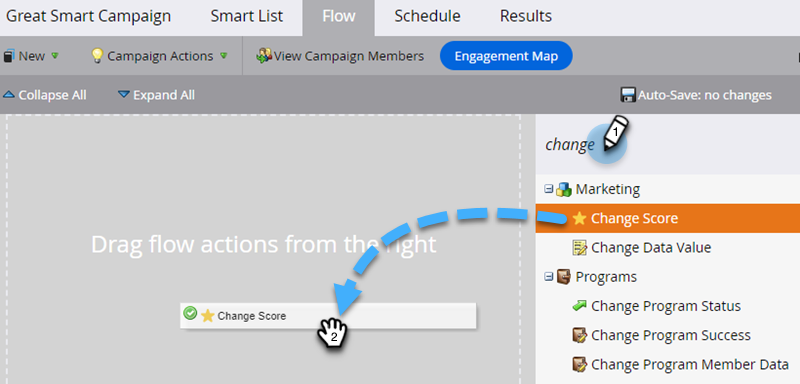

# Hinzufügen eines Flussschritts zu einer Smart-Kampagne {#add-a-flow-step-to-a-smart-campaign}

Flussschritte zeigen Marketo Engage, was Sie einer Gruppe von Personen, die sich qualifizieren, vorstellen möchten.

1. Navigieren Sie zu **[!UICONTROL Marketingaktivitäten]**.

   

1. Wählen Sie Ihre Smart-Kampagne aus und klicken Sie auf **[!UICONTROL Fluss]**.

   

1. Geben Sie ein, um nach einem Flussschritt zu suchen, und ziehen Sie ihn dann auf die Arbeitsfläche. Sie können mehrere Flussschritte hinzufügen. Wiederholen Sie diesen Schritt bei jedem Schritt, den die Kampagne ausführen soll.

   

1. Klicken Sie auf die gewünschte Option und den gewünschten Wert.

   

>[!NOTE]
>
>Flussschritte werden in der Reihenfolge ausgeführt, in der sie aufgeführt sind. [Flussschritte neu anordnen](/help/marketo/product-docs/core-marketo-concepts/smart-campaigns/flow-actions/reorder-the-flow-steps-in-a-smart-campaign.md){target="_blank"} um sicherzustellen, dass sie in der richtigen Reihenfolge sind.

>[!TIP]
>
>Im Falle eines ungültigen Eintrags wird eine rote geräuschvolle Linie angezeigt. Bewegen Sie den Mauszeiger über die Zeile, um zu sehen, wie sie korrigiert werden kann.

Fantastisch! Stellen Sie sicher, [Überprüfen und Validieren der Smart-Kampagne](/help/marketo/product-docs/core-marketo-concepts/smart-campaigns/creating-a-smart-campaign/smart-campaign-checklist.md){target="_blank"} bevor Sie sie planen oder aktivieren.

>[!MORELIKETHIS]
>
>* [Auswahl in einem Flussschritt hinzufügen](/help/marketo/product-docs/core-marketo-concepts/smart-campaigns/flow-actions/use-add-choice-in-a-flow-step.md){target="_blank"}
>* [Ordnen Sie die Flussschritte in einer Smart-Kampagne neu an.](/help/marketo/product-docs/core-marketo-concepts/smart-campaigns/flow-actions/reorder-the-flow-steps-in-a-smart-campaign.md){target="_blank"}
