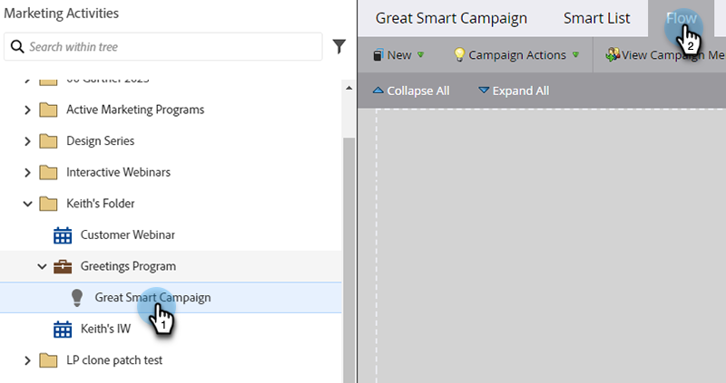

# Hinzufügen eines Flussschritts zu einer Smart-Kampagne {#add-a-flow-step-to-a-smart-campaign}

Flussschritte sagen Marketo Engage, was mit einer qualifizierten Personengruppe passieren soll.

1. Navigieren Sie **[!UICONTROL Marketing-Aktivitäten]**.

   

1. Wählen Sie Ihre Smart-Kampagne aus und klicken Sie auf **[!UICONTROL Fluss]**.

   

1. Tippen Sie, um nach einem Flussschritt zu suchen, und ziehen Sie ihn dann auf die Arbeitsfläche. Sie können mehrere Flussschritte hinzufügen. Wiederholen Sie dies mit jedem Schritt, den die Kampagne ausführen soll.

   

1. Klicken Sie auf die gewünschte Option und den gewünschten Wert.

   

>[!NOTE]
>
>Flussschritte werden in der Reihenfolge ausgeführt, in der sie aufgeführt sind. [Ordnen Sie die Flussschritte neu ](/help/marketo/product-docs/core-marketo-concepts/smart-campaigns/flow-actions/reorder-the-flow-steps-in-a-smart-campaign.md){target="_blank"}, um sicherzustellen, dass sie in der richtigen Reihenfolge vorliegen.

>[!TIP]
>
>Im Falle eines ungültigen Eintrags erscheint eine rote schnörkelige Linie. Bewegen Sie den Mauszeiger über die Linie, um zu sehen, wie Sie sie korrigieren können.

Fantastisch! Denken Sie daran[ die Smart-Kampagne zu überprüfen und zu validieren](/help/marketo/product-docs/core-marketo-concepts/smart-campaigns/creating-a-smart-campaign/smart-campaign-checklist.md){target="_blank"} bevor Sie sie planen oder aktivieren.

>[!MORELIKETHIS]
>
>* [Verwenden von Auswahl hinzufügen in einem Flussschritt](/help/marketo/product-docs/core-marketo-concepts/smart-campaigns/flow-actions/use-add-choice-in-a-flow-step.md){target="_blank"}
>* [Ordnen Sie die Flussschritte in einer intelligenten Kampagne neu an](/help/marketo/product-docs/core-marketo-concepts/smart-campaigns/flow-actions/reorder-the-flow-steps-in-a-smart-campaign.md){target="_blank"}
