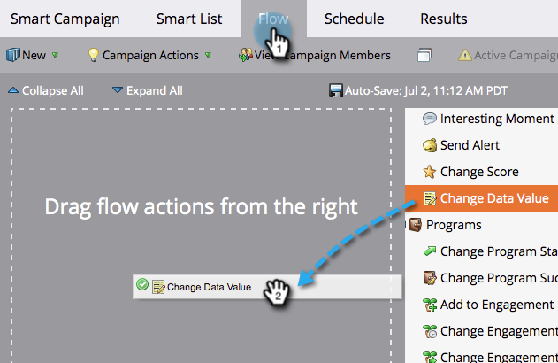
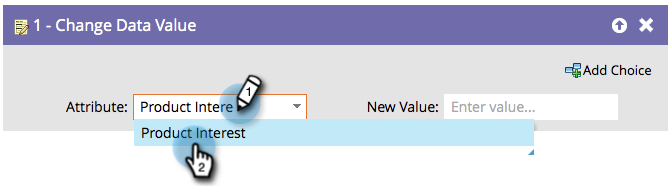

# Anfügen von Daten an ein Feld {#append-data-to-a-field}

Das Anhängen von Daten an ein Feld ist unkompliziert.

>[!PREREQUISITES]
>
>[Erstellen einer Kampagne](/help/marketo/product-docs/core-marketo-concepts/smart-campaigns/creating-a-smart-campaign/create-a-new-smart-campaign.md){target="_blank"}

>[!NOTE]
>
>Die folgenden Schritte gelten auch für [Ändern von Programmteilnehmerdaten](/help/marketo/product-docs/core-marketo-concepts/smart-campaigns/program-flow-actions/change-program-member-data.md){target="_blank"}.

1. Ziehen Sie auf **[!UICONTROL Registerkarte]** Fluss **[!UICONTROL den Schritt Datenwert ändern]**.

   

1. Suchen Sie das Feld, an das Sie Daten anhängen möchten, und wählen Sie es aus.

   

1. Suchen Sie das Token für dasselbe Feld, an das Sie Daten anhängen möchten, und wählen Sie es aus.

   

1. Fügen Sie nun den Wert, den Sie anhängen möchten, zu dem hinzu, was bereits im Feld vorhanden ist.

   

Sie können mehrere Token im selben Feld hinzufügen.
