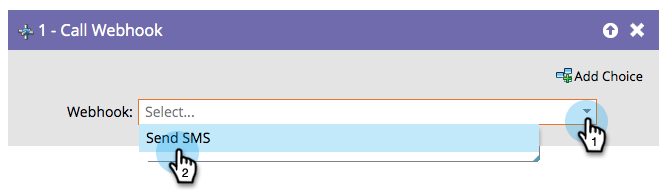

# Webhook aufrufen {#call-webhook}

>[!PREREQUISITES]
>
>[Erstellen eines Webhooks](/help/marketo/product-docs/administration/additional-integrations/create-a-webhook.md){target="_blank"}

Webhooks ermöglichen die Interaktion mit Diensten von Drittanbietern. Senden/Empfangen von Informationen durch Aufruf eines Webhooks in einem intelligenten Kampagnenfluss.

>[!NOTE]
>
>Erfahren Sie mehr über die vielen faszinierenden Dinge[ die „Webhooks](https://experienceleague.adobe.com/en/docs/marketo-developer/marketo/webhooks/webhooks){target="_blank"} für Sie tun können.

1. Wählen Sie einen Webhook aus der Dropdownliste aus.

Ihr Webhook wird jetzt aufgerufen, sobald Personen in den Fluss der intelligenten Kampagne eintreten.

>[!MORELIKETHIS]
>
>[Verwenden eines Webhooks in einer intelligenten Kampagne](/help/marketo/product-docs/core-marketo-concepts/smart-campaigns/flow-actions/use-a-webhook-in-a-smart-campaign.md){target="_blank"}
