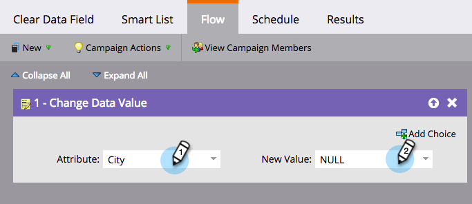

# Feldwerte löschen {#clear-field-values}

** Datenwert ändern** ist großartig, aber wie *entfernen* Sie den Wert vollständig? Gute Frage!

1. Wählen Sie im Flussschritt das Feld, das Sie löschen möchten, und geben Sie **NULL **(Großbuchstaben) als **Neuer Wert** ein.

   

1. Boom! Ich wette, du wusstest das nicht! Nach Abschluss des Flussschritts wird der Wert des ausgewählten Felds gelöscht.

   

   >[!CAUTION]
   >
   >Wenn Sie den neuen Wert leer lassen oder einfach einen Leerzeichen eingeben, wird das Feld nicht wirklich leer. Sie müssen NULL eingeben. Beachten Sie auch, dass Flussschritte nach dem Ausführen nicht rückgängig gemacht werden können.

   

Übrigens befindet sich diese kleine Technik in der Zertifizierungsprüfung von Marketo. Sag ihnen nicht, dass wir das gesagt haben!