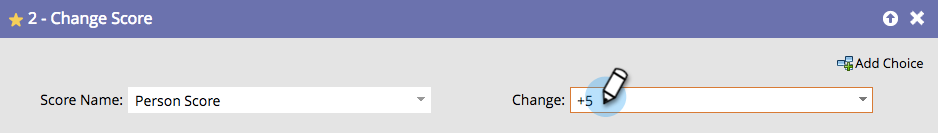

# Ändern von Bewertung {#change-score}

Die Bewertung von Personen ist einfach und leistungsstark und hilft Ihrem Verkaufsteam, Prioritäten zu setzen.

1. Wählen Sie das Bewertungsfeld aus, das Sie ändern möchten.

   

   >[!TIP]
   >
   >Sie können mehrere Bewertungsfelder erstellen. Weitere [&#x200B; finden Sie unter „Erstellen eines benutzerdefinierten Felds &#x200B;](/help/marketo/product-docs/administration/field-management/create-a-custom-field-in-marketo.md){target="_blank"} Marketo&quot;.

1. Geben Sie die gewünschte Score-Änderung ein.

   

   Änderungen:

   * **+5** zu erhöhen
   * **-5** verringert sich (negative Zahlen zulässig)
   * **=5** ergibt die exakte Punktzahl
   * **=-5** ergibt den Score mit genau dieser negativen Zahl

Schnelles Einsetzen einer grundlegenden Bewertung und anschließende Anpassung der Ergebnisse im Laufe der Zeit.
