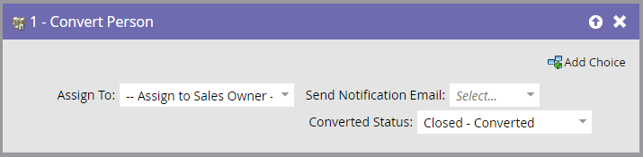
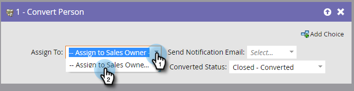

# Konvertieren von Person {#convert-person}

Verwenden Sie diesen Flussschritt, um eine Person in [!DNL Salesforce] in einen Kontakt zu konvertieren. Sie können entscheiden, wem Sie den Kontakt zuweisen, eine Benachrichtigung an den Eigentümer senden und einen konvertierten Status festlegen möchten.

>[!NOTE]
>
>Dies ist nur bei Integration mit [!DNL Salesforce] verfügbar.

1. Wählen Sie aus, wem Sie den resultierenden Kontakt, das Konto und die Opportunity zuweisen möchten.

   

   >[!CAUTION]
   >
   >Die Konvertierung einer Person in Marketo führt zu einem neuen Konto und einer neuen Opportunity in [!DNL Salesforce]. Wenn Sie keine doppelten Konten wünschen, verwenden Sie [!DNL Salesforce] zum Konvertieren.

1. Wählen Sie aus, ob eine **[!UICONTROL Benachrichtigung]** an den Eigentümer gesendet werden soll oder nicht.

   

1. Wählen Sie den **[!UICONTROL Konvertierungsstatus]** aus.

   
