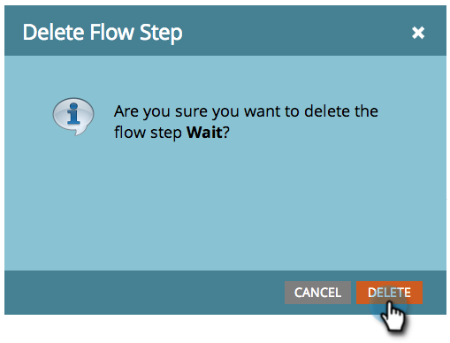

# Flussschritt löschen {#delete-a-flow-step}

>[!CAUTION]
>
>Wenn Sie Flussproben entfernen, kann _vor allem die Warteschritte_ aus aktiven Smart-Kampagnen zu unerwarteten Ergebnissen führen. Lesen Sie diesen Artikel aufmerksam durch.

Lassen Sie uns zunächst die Grundlagen behandeln. So können Sie einen unerwünschten Flussschritt aus einer Smart-Kampagne entfernen.

1. Klicken Sie in der Smart-Kampagne **[!UICONTROL Fluss]** auf das Symbol **X** , um jeden Flussschritt zu löschen.

   

1. Klicken Sie auf **[!UICONTROL Löschen]**.

   

   >[!CAUTION]
   >
   >Das Löschen, Hinzufügen und Verschieben von Schritten innerhalb einer _aktiven_ Kampagne kann definitiv zu unerwarteten Ergebnissen führen. Ziehen Sie die Erstellung einer neuen Kampagne in Erwägung, testen Sie sie und wechseln Sie dann.

   Änderungen können an einer aktiven Kampagne vorgenommen werden, können aber unvorhergesehene Folgen haben. Im Folgenden finden Sie die Details:

   **Smart-Kampagnen stapeln**

   Wenn Ihre Kampagne:

   1. **Nie ausgeführt**. Nehmen Sie alle gewünschten Änderungen vor. Bis zum Ausführen dieser Kampagne wirkt sich dies auf niemanden aus.
   1. **ist eine wiederkehrende Smart-Kampagne**. Die Änderungen wirken sich auf die Benutzer in zukünftigen Ausführungen aus, nicht auf vorherige Ausführungen.
   1. **Bereits ausgeführt, OHNE die Schritte zum Warten zu warten**. Es sind keine Personen betroffen, da die Kampagne nach der Ausführung ruhend ist.
   1. **Wird gerade ausgeführt**. Änderungen können abhängig vom Zeitpunkt und den Details des Löschvorgangs zu unerwartetem Verhalten führen. Es wird dringend empfohlen, KEINE Batch-Kampagne zu bearbeiten, die aktiv ausgeführt wird. In Notfällen erfahren Sie, wie Sie [eine laufende Smart-Kampagne abbrechen](/help/marketo/product-docs/core-marketo-concepts/smart-campaigns/using-smart-campaigns/abort-a-smart-campaign.md){target="_blank"}.

   1. **Bereits MIT Warteschritten ausgeführt.** Mehrere Details zu diesem.\
      Wenn eine Person in einen Warteschritt eintritt, teilt sie die Dauer mit und gibt an, zu welchem NUMBER-SCHRITT sie zurückkehren soll. Siehe Beispiel unten.

   **Smart-Kampagnen für Trigger**

   1. **Keine Warteschritte**. Wenn Sie einen normalen Schritt löschen, sind nur Personen betroffen, die die Kampagne in der Zukunft durchlaufen.
   1. **Mit Warteschritten**. Siehe Beispiel unten für Batch-Kampagnen. Dieselbe Logik gilt.

   >[!NOTE]
   >
   >**Beispiel**
   >
   >1. Eine Smart-Kampagne besteht aus drei Schritten.
   >    * SCHRITT 1 E-Mail Nr. 1 senden
   >    * SCHRITT 2 Warten 1 Woche
   >    * SCHRITT 3. E-Mail Nr. 2 senden
   >
   >1. Personen, die auf **Schritt 2** klicken, warten eine Woche, bevor sie zu **Schritt 3** wechseln.
   >1. Sie löschen **Schritt 2** während der Woche.
   >1. Die Leute warten weiterhin die Woche (sie tauchen nicht automatisch in den Fluss zurück).
   >1. Wenn sie schließlich zurückkehren, versuchen sie, zu **Schritt 3** zu wechseln. Sie werden es nicht finden.
   >1. **WICHTIG:** Da es jetzt nur zwei Schritte gibt, erhalten die Personen _keine E-Mail 2_.
