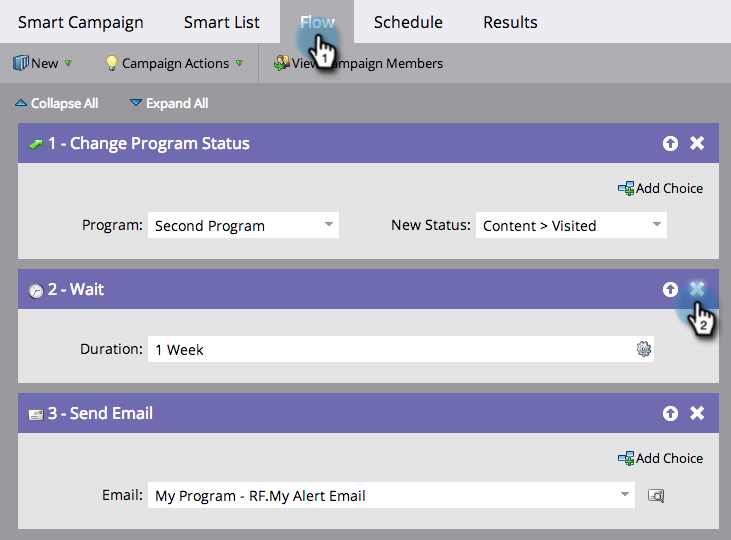

# Löschen eines Flussschritts {#delete-a-flow-step}

>[!CAUTION]
>
>Das Entfernen von Flussschritten _insbesondere Warteschritten_ aus aktiven Smart-Kampagnen kann zu unerwarteten Ergebnissen führen. Lesen Sie diesen Artikel sorgfältig.

Lassen Sie uns zunächst die Grundlagen behandeln. So entfernen Sie einen unerwünschten Flussschritt aus einer Smart-Kampagne.

1. Klicken Sie in der Smart **[!UICONTROL Fluss]** auf das **X**-Symbol, um jeden Flussschritt zu löschen.

   

1. Klicken Sie auf **[!UICONTROL Löschen]**.

   

   >[!CAUTION]
   >
   >Das Löschen, Hinzufügen und Verschieben von Schritten innerhalb einer _aktiven_ Kampagne kann definitiv zu unerwarteten Ergebnissen führen. Erwägen Sie, eine neue Kampagne zu erstellen, sie zu testen und dann zu wechseln.

   An einer aktiven Kampagne können Änderungen vorgenommen werden, die jedoch unvorhergesehene Folgen haben können. Im Folgenden finden Sie die Details:

   **Batch-Smart-Kampagnen**

   Wenn Ihre Kampagne:

   1. **Nie gerannt**. Nehmen Sie alle gewünschten Änderungen vor. Dies wirkt sich erst auf andere aus, wenn Sie diese Kampagne ausführen.
   1. **Ist eine wiederkehrende intelligente Kampagne**. Die Änderungen betreffen Personen in zukünftigen Ausführungen, nicht in vorherigen Ausführungen.
   1. **Wurde bereits OHNE Warteschritte ausgeführt**. Es sind keine Personen betroffen, da die Kampagne nach der Ausführung inaktiv ist.
   1. **Wird gerade ausgeführt**. Änderungen können je nach Zeitpunkt und Details des Löschvorgangs zu unerwartetem Verhalten führen. Es wird dringend empfohlen, keine Batch-Kampagne zu bearbeiten, die aktiv ausgeführt wird. Erfahren Sie in Notfällen, wie Sie [ laufende intelligente Kampagne abbrechen ](/help/marketo/product-docs/core-marketo-concepts/smart-campaigns/using-smart-campaigns/abort-a-smart-campaign.md){target="_blank"}.

   1. **Bereits mit Warteschritten ausgeführt.** Mehrere Details zu diesem.
Wenn eine Person in einen Warteschritt eintritt, notiert die Person die Dauer und den ZAHLENSCHRITT, zu dem sie zurückkehren soll. Siehe Beispiel unten.

   **Intelligente Trigger-Kampagnen**

   1. **Keine Warteschritte**. Wenn Sie einen normalen Schritt löschen, sind nur Personen betroffen, die die Kampagne in der Zukunft durchlaufen.
   1. **Mit Warteschritten**. Unten finden Sie ein Beispiel für Batch-Kampagnen. Dieselbe Logik gilt.

   >[!NOTE]
   >
   >**Beispiel**
   >
   >1. Eine intelligente Kampagne besteht aus drei Schritten.
   >    * SCHRITT 1. E-Mail #1 senden
   >    * SCHRITT 2. 1 Woche warten
   >    * SCHRITT 3. E-Mail #2 senden
   >
   >1. Personen, die **Schritt 2** drücken, warten eine Woche, bevor sie mit **Schritt 3** fortfahren.
   >1. Sie löschen **Schritt 2** während der Woche.
   >1. Die Personen warten weiterhin die erste Woche (sie kehren nicht automatisch in den Fluss zurück).
   >1. Wenn sie schließlich zurückkehren, versuchen sie, zu **Schritt 3** zu gehen. Sie werden es nicht finden.
   >1. **WICHTIG:** Da es jetzt nur noch zwei Schritte gibt, erhalten die Personen _keine E-Mail-#2_.
