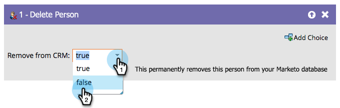

# Person löschen {#delete-person}

Fehlerhafte Personen gelangen manchmal in Ihre Datenbank. Mit dem Schritt „Personenfluss löschen“ können Sie diese entfernen.

>[!CAUTION]
>
>Wenn Sie eine Person löschen, werden auch alle ihre historischen RCE-Daten gelöscht. Das kann nicht rückgängig gemacht werden.

1. Wenn Sie im Flussschritt ziehen, wird er automatisch auch auf Aus Ihrem CRM löschen eingestellt.

   

1. Sie können wie folgt von der Marketo Engage und nicht aus Ihrem CRM löschen:

   

>[!NOTE]
>
>Das Entfernen der Person aus Ihrem CRM _funktioniert nur mit[!DNL Salesforce]_. Wenn Sie eine Person aus Marketo löschen und in [!DNL Salesforce] lassen, wird sie in Marketo neu erstellt, sobald ihr [!DNL Salesforce]-Eintrag aktualisiert wird.
