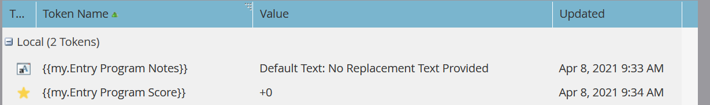

# Kampagne ausführen {#execute-campaign}

Eine ausführbare Kampagne enthält wie andere Kampagnen eine Smart List, einen Fluss und einen Zeitplan. Im Gegensatz zu anderen Kampagnen planen oder aktivieren Sie diese nicht. Er kann nur von einer anderen Kampagne über den Schritt Kampagnenfluss ausführen aufgerufen werden. Die Flussschritte in der ausführbaren Kampagne werden in Serie mit der übergeordneten Kampagne ausgeführt (im Gegensatz zu Anfragekampagnen, die parallel in einer separaten Trigger-Kampagne ausgeführt werden).

>[!NOTE]
>
>Ausführbare Kampagnen sind stets untergeordnete Elemente der (übergeordneten) Kampagne, die sie aufruft.

## Verwendung von „Kampagne ausführen“ {#when-to-use-execute-campaign}

Es gibt viele Dinge, die Sie mit einer ausführbaren Kampagne tun können. Sie erleichtern gängige Betriebsaufgaben wie Lead-Routing, Lebenszyklusmanagement und Bewertung (unter anderem) und können für die Ausführung desselben Workflows in Batch- oder ausgelösten Kampagnen verwendet werden.

Sie können sie auch verwenden, wenn Sie einen separaten Fluss ausführen müssen, aber Sie müssen sich in nachfolgenden Flussschritt-Entscheidungen auf die Ergebnisse dieses Flusses verlassen (d. h. wenn dies der Fall ist).

Die Ausführung von Campaign ist eine Verbesserung auf [Kampagne anfordern](/help/marketo/product-docs/core-marketo-concepts/smart-campaigns/flow-actions/request-campaign.md) da sie seriell ausgeführt werden kann, während letztere nur parallel ausgeführt wird.

>[!NOTE]
>
>Warteschritte und Webhooks werden niemals mit ausführbaren Kampagnen kompatibel sein. Für diese müssen Sie stattdessen „Kampagne anfragen“ verwenden.

## Erstellen einer ausführbaren Kampagne {#how-to-create-an-executable-campaign}

1. Klicken Sie mit der rechten Maustaste auf das gewünschte Programm und wählen Sie **[!UICONTROL Neue Smart-Kampagne]** aus.

   

1. Geben Sie ihm einen Namen, aktivieren Sie das **[!UICONTROL Ausführbare]** Kontrollkästchen und klicken Sie auf **[!UICONTROL Erstellen]**.

   

1. Definieren Sie die Smart-Liste und den Fluss wie jede andere Smart-Kampagne.

Sie können auch eine vorhandene Smart Campaign klonen. Wenn Sie eine vorhandene ausführbare Kampagne klonen, müssen Sie nach dem Benennen weiterhin das Kontrollkästchen **[!UICONTROL ausführbar]** aktivieren.

>[!NOTE]
>
>Eine Kampagne mit Triggern kann nicht geklont werden.

## Token-Kontext der übergeordneten Kampagne verwenden {#use-parent-campaign-token-context}

Bei Festlegung auf „true“ werden die folgenden Token-Kontexte an die untergeordnete Kampagne gesendet (der derzeit ausgeführte):

* Meine Token
* Kampagnen-Token
* Programm-Token
* Mitglieds-Token
* [Trigger-Token](/help/marketo/product-docs/marketo-sales-insight/msi-for-salesforce/features/tabs-in-the-msi-panel/interesting-moments/trigger-tokens-for-interesting-moments.md) (wenn von einer ausgelösten Kampagne aufgerufen)

**API-Interaktion**

Bei Verwendung von Kampagne planen oder anfragen [in der API](https://experienceleague.adobe.com/de/docs/marketo-developer/marketo/rest/assets/smart-campaigns#batch) können Sie Werte für „Meine Token“ übergeben, wodurch die Werte überschrieben werden, die für diese Token in der von Ihnen aufgerufenen Kampagne festgelegt sind. Wenn diese Kampagne dann eine andere Kampagne ausführt und „Übergeordneten Kontext verwenden auf „True“ setzt, werden die über die API übergebenen Werte anstelle der in der Anwendung festgelegten Werte verwendet.

## Zu beachtende Punkte {#things-to-note}

* Die Smart List filtert alle Personen heraus, die sich nicht qualifizieren. Wenn eine Person qualifiziert ist, werden sie im resultierenden Aktivitätsdatensatz der ausgeführten Kampagne als „Qualifiziert: TRUE“ (und FALSE, wenn nicht) aufgelistet
* Es gelten die Regeln für die Kampagnenqualifizierung planen (Einstellungen für intelligente Kampagnen auf der Registerkarte Zeitplan)
* Ausführbare Kampagnen können nicht über Arbeitsbereiche hinweg aufgerufen werden
* Wenn Sie die Flussaktion [Aus Fluss entfernen](/help/marketo/product-docs/core-marketo-concepts/smart-campaigns/flow-actions/remove-from-flow.md) verwenden, die auf eine ausführbare Kampagne abzielt, werden sowohl das untergeordnete als auch das übergeordnete Element ausgewählt
* Nutzung der Token-Vererbung - Wenn Sie beispielsweise über einen einzigen gemeinsamen Scoring-Fluss verfügen, der durch mehrere verschiedene Assets ausgelöst wird, können Sie in der untergeordneten Kampagne und in der übergeordneten Kampagne einen Standard-Wert für „Mein Token“ definieren, sodass Sie den Wert der untergeordneten Score-Kampagne für Ihre übergeordneten Kampagnen überschreiben können (siehe folgendes visuelles Beispiel)
* Ausführbare Kampagnen können bis zu drei Ebenen tief aufgerufen werden (z. B. übergeordnete Kampagne > Untergeordnet > Untergeordnet)

>[!CAUTION]
>
>Lassen Sie Ihre Smart Lists für ausführbare Kampagnen niemals ungültig, da _(niemand_ sich dafür qualifiziert. Best Practice ist es, separate Smart List-Assets zu erstellen, sie vollständig zu definieren und ihre Gültigkeit sicherzustellen. Verwenden Sie dann den Filter „Mitglied der Smart-Liste“ in der ausführbaren Kampagne, damit Sie Ihre Smart-Listen-Definition austauschen können.

## Beispiel für Token-Vererbung {#token-inheritance-example}

Im Folgenden finden Sie ein visuelles Beispiel für die Token-Vererbung in einer ausführbaren Kampagne und zwei übergeordneten Kampagnen: eine mit dem Token-Kontext **[!UICONTROL True]** und die andere mit **[!UICONTROL False]**.

Untergeordnete Kampagne mit einem Token-Änderungswert.

Meine Token der untergeordneten Kampagne.

### Beispiel 1: wahr {#example-one-true}

Im Schritt Kampagnenfluss ausführen der ersten übergeordneten Kampagne wird &quot;[!UICONTROL Übergeordneter Kampagnen-Token-Kontext verwenden] auf &quot;**[!UICONTROL &quot;]**.

Die Token der übergeordneten Kampagne.

Die Ergebnisse: Punktzahl um +10 geändert.

### Beispiel 2: false {#example-two-false}

Im Schritt Kampagnenfluss ausführen der zweiten übergeordneten Kampagne wird „Übergeordneter Kampagnen-Token-Kontext verwenden“ auf &quot;**&quot;**.

Die Token der übergeordneten Kampagne.

Die Ergebnisse: Score wurde nicht geändert, da der Score-Wert der untergeordneten Kampagne, +0, verwendet wurde.

