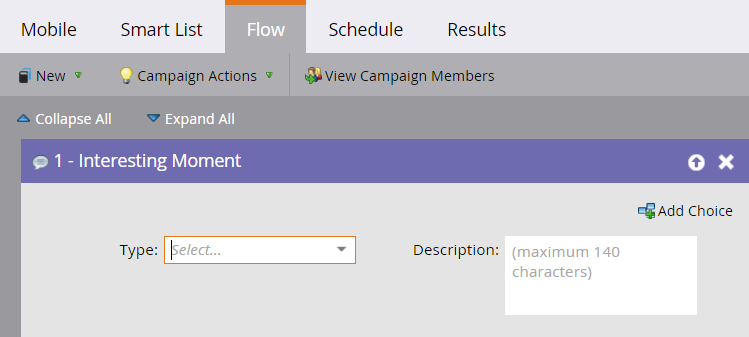

# Interessanter Moment {#interesting-moment}

Wenn Sie über Marketo Sales Insight verfügen, können Sie den Flussschritt **Interessanter Moment** verwenden, um Ihrem Vertriebsteam Einblicke in die coolen Dinge zu geben, die Ihre Mitarbeiter tun.

1. Wählen Sie den interessanten Moment **[!UICONTROL Typ]** den Sie verwenden möchten.

   

1. Erstellen Sie **[!UICONTROL Beschreibung]** die Ihrem Verkaufsteam den interessanten Moment erklärt.

   

   >[!TIP]
   >
   >_Weniger ist mehr_. Arbeiten Sie mit Ihrem Verkaufsteam zusammen, um sicherzustellen, dass interessante Momente tatsächlich interessant sind.

Sie können auch [Token in interessanten Momenten“ verwenden](/help/marketo/product-docs/marketo-sales-insight/msi-for-salesforce/features/tabs-in-the-msi-panel/interesting-moments/trigger-tokens-for-interesting-moments.md){target="_blank"} um wirklich nützliche dynamische Beschreibungen zu erstellen.

>[!MORELIKETHIS]
>
>* [Mit interessanten Momenten](/help/marketo/product-docs/marketo-sales-insight/msi-for-salesforce/features/tabs-in-the-msi-panel/interesting-moments/using-interesting-moments.md){target="_blank"}
>* [Token für interessante Momente](/help/marketo/product-docs/marketo-sales-insight/msi-for-salesforce/features/tabs-in-the-msi-panel/interesting-moments/trigger-tokens-for-interesting-moments.md){target="_blank"}
