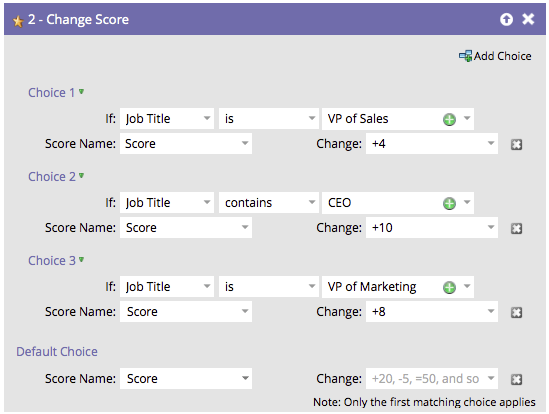

# Auswahl in einem Flussschritt neu anordnen {#reorder-add-choice-in-a-flow-step}

Da nur die erste passende Auswahl für eine Person gilt, ist die Reihenfolge wichtig. Wenn Sie die Reihenfolge der in einem Flussschritt festgelegten Bedingungen ändern möchten, sehen Sie folgendes Beispiel.

1. Suchen Sie den Flussschritt, für den Sie die Reihenfolge einer Auswahl ändern möchten.

   

1. In diesem Beispiel verschieben wir Auswahl 3 über Auswahl 2 nach oben. Klicken Sie auf **[!UICONTROL Auswahl 3]** und dann auf **[!UICONTROL Nach oben]**.

   

   >[!NOTE]
   >
   >Bei der Neuanordnung können Sie **[!UICONTROL Nach oben]**, **[!UICONTROL Nach unten]** oder **[!UICONTROL Verschieben nach]**.

   Gute Arbeit! Jetzt wissen Sie, wie Sie eine Auswahl in Einzelschritten nach oben/unten verschieben können.

   

**OPTIONALER SCHRITT**: Wenn Sie viele Auswahlmöglichkeiten haben und eine mehrere Ebenen nach oben oder unten verschieben müssen, können Sie diese alternative Methode verwenden, um Zeit zu sparen. Klicken Sie auf die Auswahl, die Sie verschieben möchten, und ziehen Sie dann unter **[!UICONTROL Verschieben nach]** den Schieberegler an die Position, an die Sie die Auswahl verschieben möchten.

So einfach können Sie die Reihenfolge Ihrer Flussschritt-Entscheidungen neu organisieren.
