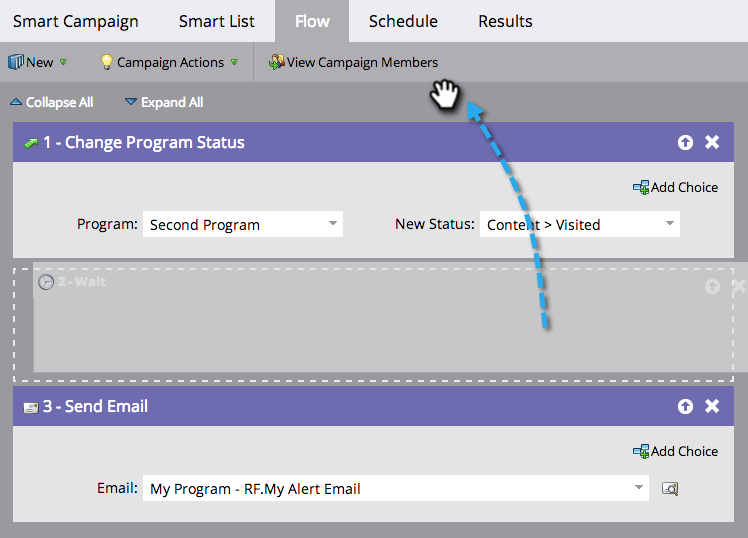

# Neuanordnen der Flussschritte in einer intelligenten Kampagne {#reorder-the-flow-steps-in-a-smart-campaign}

Flussschritte werden von oben nach unten ausgeführt.

>[!PREREQUISITES]
>
>[Hinzufügen eines Flussschritts zu einer Smart-Kampagne](/help/marketo/product-docs/core-marketo-concepts/smart-campaigns/flow-actions/add-a-flow-step-to-a-smart-campaign.md)

1. Ziehen Sie den Fluss-Schritt in **[!UICONTROL Registerkarte]** Fluss“ der intelligenten Kampagne einfach per Drag-and-Drop an die gewünschte Position.

>[!NOTE]
>
>Die Flussschritte werden in der Reihenfolge ausgeführt, in der sie im Fluss angezeigt werden.
