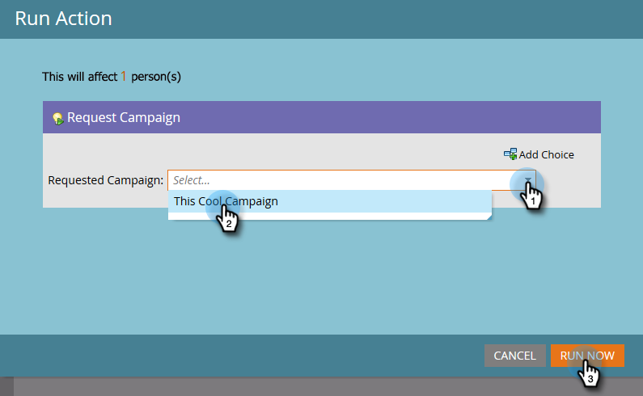

# Kampagne anfordern {#request-campaign}

Sie können Personen mithilfe der[!UICONTROL Anforderungskampagne]&quot; Schritt für einen einzigen Fluss.

>[!NOTE]
>
>Die Kampagne, in der Sie die Person platzieren, muss aktiv sein und die [Kampagne wird angefordert](/help/marketo/product-docs/core-marketo-concepts/smart-campaigns/using-smart-campaigns/setting-up-a-trigger-smart-campaign-for-sales-using-campaign-is-requested.md){target="_blank"} Trigger.

1. Im **[!UICONTROL Datenbank]**, suchen und wählen Sie die gewünschte(n) Person(en) aus.

   

1. Klicks **[!UICONTROL Personenaktionen]**, bewegen Sie den Mauszeiger über **[!UICONTROL Sonderaktion]** und wählen Sie **[!UICONTROL Anforderungskampagne]**.

   

1. Wählen Sie die Kampagne aus, in die die Person platziert werden soll, und klicken Sie auf **[!UICONTROL Jetzt ausführen]**.

   

1. Oben rechts auf dem Bildschirm sehen Sie, wann es fertig ist. Klicks **[!UICONTROL Ergebnisse anzeigen]**.

   

   Ihre Person befindet sich nun in der gewünschten Kampagne.

   

   Fantastische Arbeit!

>[!TIP]
>
>Verwenden Sie die[!UICONTROL Kampagne wird angefordert]&quot;Trigger oder Filter, um Personen zu finden, die von diesem Flussschritt betroffen sind.
