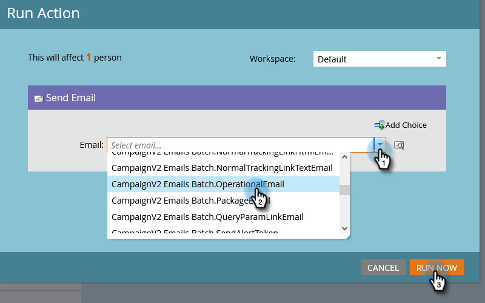

# Einzelne Flussaktionen auf der Seite „Personendetails“ {#single-flow-actions-from-person-detail-page}

Zusätzlich zur Ausführung von einzelnen Flussaktionen aus einer Smart-Liste können Sie diese auch direkt auf einer Personendetailseite ausführen.

1. Klicken Sie auf **[!UICONTROL Datenbank]**.

   

1. Suchen Sie die gewünschte Person.

   

1. Klicken Sie auf **[!UICONTROL Personenaktionen]** und wählen Sie den gewünschten Flussschritt aus. In diesem Beispiel verwenden wir [E-Mail senden](/help/marketo/product-docs/core-marketo-concepts/smart-campaigns/flow-actions/send-email.md){target="_blank"}.

   

1. Wählen Sie die gewünschte E-Mail aus und klicken Sie auf **[!UICONTROL Jetzt ausführen]**.

   

>[!NOTE]
>
>Wenn Ihre Instanz Arbeitsbereiche/Partitionen enthält und Sie direkt zu einer Personendetailseite navigieren (z. B. über einen Link), anstatt von einer Seite/einem Asset zu kommen, das mit einer Workspace verknüpft ist, müssen Sie in Schritt 4 auch eine Workspace auswählen.
