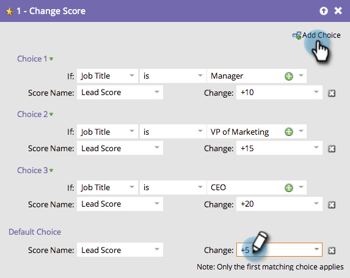

# Verwenden von Auswahl hinzufügen in einem Flussschritt {#use-add-choice-in-a-flow-step}

>[!PREREQUISITES]
>
>[Hinzufügen eines Flussschritts zu einer Smart-Kampagne](/help/marketo/product-docs/core-marketo-concepts/smart-campaigns/flow-actions/add-a-flow-step-to-a-smart-campaign.md){target="_blank"}

Mit „Auswahl hinzufügen“ können Sie einen Flussschritt verwenden und sagen „Es kommt darauf an“, wenn Sie die Details auswählen.

1. Fügen Sie auf der **[!UICONTROL Fluss]** der Smart-Kampagne einen beliebigen Flussschritt hinzu und klicken Sie dann auf **[!UICONTROL Auswahl hinzufügen]**.

   

1. Wählen Sie die Auswahlbedingung aus.

   

1. Wählen Sie den Auswahloperator aus und geben Sie einen Auswahlwert ein. Dadurch werden Ihre Kriterien oder Auswahlmöglichkeiten festgelegt.

   

1. Geben Sie einen Flussschrittwert für die Auswahl ein.

   

   >[!CAUTION]
   >
   >Token funktionieren _nicht_ im Bedingungsteil eines Auswahlflussschritts.

1. Wiederholen Sie die obigen Schritte, um mehrere Auswahlmöglichkeiten hinzuzufügen, und fügen Sie dann den Standardwert hinzu bzw. passen Sie ihn an.

   

   >[!TIP]
   >
   >Sie können einen Ihrer Flussschritte auf —Nichts tun— einstellen. In diesem Fall wird keine Aktion für diese Auswahl durchgeführt.

   >[!CAUTION]
   >
   >Nur die erste übereinstimmende Auswahl wird auf den Flussschritt angewendet. Erfahren Sie, wie [ „Auswahl hinzufügen“ in einer Flussaktion neu anordnen ](/help/marketo/product-docs/core-marketo-concepts/smart-campaigns/flow-actions/reorder-add-choice-in-a-flow-step.md){target="_blank"}.

   Sehr gut! Sie können jetzt eine einzelne intelligente Kampagne mit Flussschritt-Auswahlmöglichkeiten erstellen, anstatt für jede Auswahl mehrere intelligente Kampagnen zu erstellen.

   >[!MORELIKETHIS]
   >
   >[Auswahl in einem Flussschritt neu anordnen](/help/marketo/product-docs/core-marketo-concepts/smart-campaigns/flow-actions/reorder-add-choice-in-a-flow-step.md){target="_blank"}
