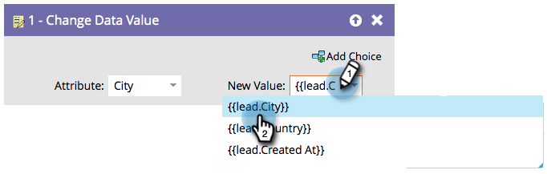

# Verwenden von Token in Flussschritten {#use-tokens-in-flow-steps}

>[!PREREQUISITES]
>
>[Hinzufügen eines Flussschritts zu einer Smart-Kampagne](/help/marketo/product-docs/core-marketo-concepts/smart-campaigns/flow-actions/add-a-flow-step-to-a-smart-campaign.md){target="_blank"}

Ein Token ist eine Variable. Sie können ihn in E-Mails, Landingpages und intelligenten Kampagnen verwenden, um Ihnen das Leben zu erleichtern. Sie können [Meine Token](/help/marketo/product-docs/core-marketo-concepts/programs/tokens/understanding-my-tokens-in-a-program.md){target="_blank"} (benutzerdefinierte Token) in Flussschritten, Webhooks, E-Mails und Landingpages verwenden. Sie können Token verwenden, um Variableninhalte in diese Flussschritte einzuschließen:

* Datenwert ändern
* Programmmitgliedsdaten ändern
* Interessanter Moment
* Salesforce Campaign-Schritte (Hinzufügen, Entfernen, Ändern des Status)
* Aufgabe erstellen
* Warnhinweis senden (nur in Trigger-Kampagnen)

1. Beginnen Sie im Flussschritt mit der Eingabe von `{{`, um Token-Kategorien abzurufen.

   

   >[!NOTE]
   >
   >Unter [Token-Übersicht](/help/marketo/product-docs/demand-generation/landing-pages/personalizing-landing-pages/tokens-overview.md){target="_blank"} finden Sie eine Liste mehrerer verfügbarer Token.

1. Tippen Sie so lange, bis Sie das gewünschte Token gefunden haben, und klicken Sie zum Auswählen darauf.

   

   >[!TIP]
   >
   >In den Schritten „Interessanter Moment“, „Aufgabe erstellen“ und „Warnhinweis senden“ können mehrere Token verwendet werden.

   >[!NOTE]
   >
   >Benutzerdefinierte Feld-Token für Programmteilnehmer können in folgenden Bereichen verwendet werden: Erstellen einer Aufgabe, Erstellen einer Aufgabe in Microsoft, Interessante Momente, Ändern von Datenwerten, Flussaktionen und Webhooks.

   Cool! Die Daten werden aus dem Token abgerufen, wenn die Smart Campaign ausgeführt wird.

   >[!MORELIKETHIS]
   >
   >* [Meine Token verwalten](/help/marketo/product-docs/core-marketo-concepts/programs/tokens/managing-my-tokens.md){target="_blank"}
   >* [Verstehen meiner Token in einem Programm](/help/marketo/product-docs/core-marketo-concepts/programs/tokens/understanding-my-tokens-in-a-program.md){target="_blank"}
