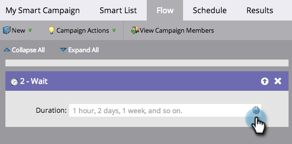

# Verwenden eines Datums-Tokens in einem Warteflussschritt {#use-a-date-token-in-a-wait-flow-step}

Sie können den Schritt „Fluss warten“ verwenden, um den Journey einer Person über eine Smart-Kampagne bis zu einem bestimmten Datum anzuhalten, das ein Datums-Token verwendet. Sie können das Enddatum auch nach einer bestimmten Anzahl von Tagen ändern.

>[!NOTE]
>
>Dies gilt nur für Trigger-Kampagnen. Sie können diese Funktion nicht in Batch-Kampagnen verwenden.

1. Ziehen Sie in der Registerkarte **[!UICONTROL Fluss]** der Smart-Kampagne den **[!UICONTROL Warten]**-Flussschritt.

   

1. Klicken Sie auf das Zahnradsymbol.

   

1. Wählen Sie in **[!UICONTROL Dropdown]** Typ“ die Option **[!UICONTROL Datumstoken]** aus.

   

1. Wählen Sie ein [!UICONTROL Datums-Token], um anzugeben, wann der Warteschritt beendet werden soll:

   * `{{my._____}}`
   * `{{lead.______}}`
   * `{{company.______}}`
   * `{{system._______}}`

   

1. Um bis zum nächsten Jahrestag des Datums zu warten, das im aktuellen oder nächsten Kalenderjahr stattfindet, aktivieren Sie das Kontrollkästchen.

   

   >[!TIP]
   >
   >Verwenden Sie diese Option für Datumstoken, die auf frühere Daten verweisen, z. B. ein Geburtstags- oder Vertragsstartdatum.

1. Optional können Sie das Enddatum um eine bestimmte Anzahl von Tagen ändern.

   

   >[!NOTE]
   >
   >Sie können die Anzahl der Tage auch mithilfe eines `{{lead.`- oder `{{company.`-Tokens angeben, das ein ganzzahliges Feld darstellt, oder mithilfe eines `{{my.`-Tokens vom Typ Zahl .

1. Klicken Sie auf **[!UICONTROL Speichern]**.

   

   >[!MORELIKETHIS]
   >
   >* [Verwenden Sie eine Dauer in einem Warteflussschritt](/help/marketo/product-docs/core-marketo-concepts/smart-campaigns/flow-actions/wait/use-a-duration-in-a-wait-flow-step.md){target="_blank"}
   >* [Verwenden eines bestimmten Datums in einem Warteflussschritt](/help/marketo/product-docs/core-marketo-concepts/smart-campaigns/flow-actions/wait/use-a-specific-date-in-a-wait-flow-step.md){target="_blank"}
