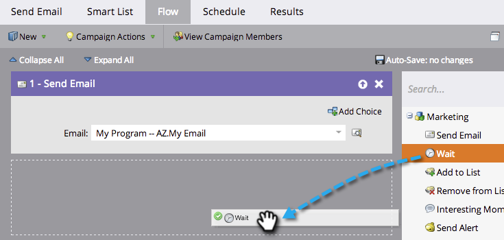

# Verwenden einer Dauer in einem Warteflussschritt {#use-a-duration-in-a-wait-flow-step}

Mit dem Schritt Fluss warten können Sie den Journey einer Person über eine Smart-Kampagne für einen bestimmten Zeitraum anhalten. Sie können auch Kriterien für den Wochentag und den Zeitpunkt, zu dem er endet, angeben.

1. Ziehen Sie in der Registerkarte **[!UICONTROL Fluss]** der Smart-Kampagne den **[!UICONTROL Warten]**-Flussschritt.

   

1. Geben Sie ein, wie lange Sie pausieren möchten.

   

1. Das ist alles! Der Fluss wird für die angegebene Dauer angehalten. Klicken Sie bei erweiterten Optionen auf das Zahnradsymbol rechts.

   

1. Geben Sie den Wochentag an, an dem der Warteschritt beendet werden soll.

   

1. Geben Sie optional die Zeit an. Klicken Sie auf **[!UICONTROL Speichern]**.

   

   >[!NOTE]
   >
   >**Beispiel**
   >
   >Eine Person Trigger am Freitag um 17 Uhr eine Smart Campaign. Der Warteschritt ist fortgeschritten: 48 Stunden und muss am Mo-Fr um 9 Uhr morgens enden.
   >
   >Das Ergebnis wäre, dass die Person am (Montag **9 Uhr morgens) im Fluss**. Dies ist das erste M-F-Datum nach 48 Stunden.

   >[!NOTE]
   >
   >Die Dauer, das Datum, die Uhrzeit und die verwendeten Tage basieren alle auf der Zeitzone Ihres Abonnements.

   >[!MORELIKETHIS]
   >
   >* [Verwenden eines bestimmten Datums in einem Warteflussschritt](/help/marketo/product-docs/core-marketo-concepts/smart-campaigns/flow-actions/wait/use-a-specific-date-in-a-wait-flow-step.md){target="_blank"}
   >* [Verwenden eines Datums-Tokens in einem Warteflussschritt](/help/marketo/product-docs/core-marketo-concepts/smart-campaigns/flow-actions/wait/use-a-date-token-in-a-wait-flow-step.md){target="_blank"}
