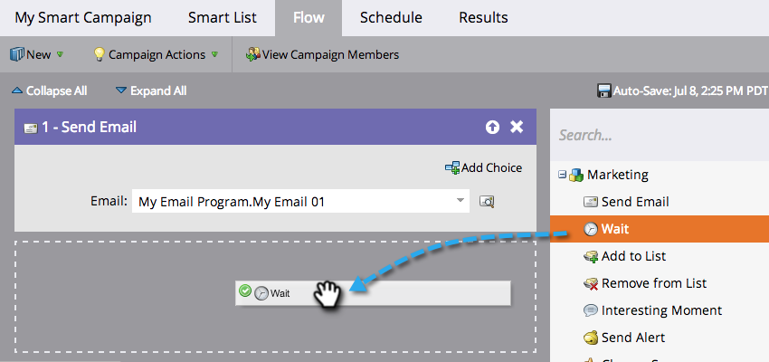
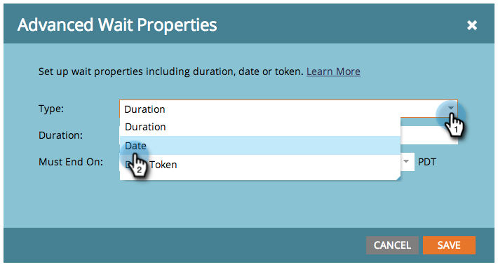

# Verwenden eines bestimmten Datums in einem Warteflussschritt {#use-a-specific-date-in-a-wait-flow-step}

Mit dem Flussschritt &quot;[!UICONTROL Warten] können Sie den Journey einer Person durch eine Smart-Kampagne bis zu einem bestimmten Datum anhalten.

1. Ziehen Sie in der Registerkarte **[!UICONTROL Fluss]** der Smart-Kampagne den **[!UICONTROL Warten]**-Flussschritt.

   

1. Klicken Sie auf das Zahnradsymbol.

   

1. Wählen Sie in **[!UICONTROL Dropdown]** Typ“ die Option **[!UICONTROL Datum]** aus.

   

1. Wählen Sie das Datum aus, an dem Sie fortfahren möchten.

   

1. Geben Sie die Zeit an (optional) und klicken Sie auf **[!UICONTROL Speichern]**.

   

>[!MORELIKETHIS]
>
>* [Verwenden Sie eine Dauer in einem Warteflussschritt](/help/marketo/product-docs/core-marketo-concepts/smart-campaigns/flow-actions/wait/use-a-duration-in-a-wait-flow-step.md){target="_blank"}
>* [Verwenden eines Datums-Tokens in einem Warteflussschritt](/help/marketo/product-docs/core-marketo-concepts/smart-campaigns/flow-actions/wait/use-a-date-token-in-a-wait-flow-step.md){target="_blank"}
