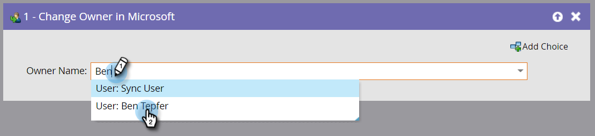

# Ändern von Eigentümer bzw. Eigentümer in Microsoft {#change-owner-in-microsoft}

Wenn Sie über vorhandene Personen verfügen, die bereits einem Eigentümer zugewiesen sind, können Sie diesen Flussschritt verwenden, um sie einem anderen Eigentümer neu zuzuweisen.

>[!NOTE]
>
>Dieser Flussschritt funktioniert _nur bei Verwendung mit Triggern_ nicht mit Filtern in Ihrer Smart-Kampagne.

**Verwendung**

1. Wählen Sie einfach den Besitzer, zu dem Sie wechseln möchten, und gehen Sie!

   

   >[!NOTE]
   >
   >Wenn der Datensatz noch nicht in Ihrem Dynamics-Konto vorhanden ist, synchronisieren wir ihn und weisen ihn dann dem ausgewählten Benutzer zu.
