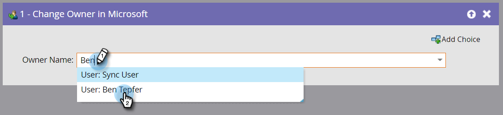

# Eigentümer in Microsoft ändern {#change-owner-in-microsoft}

Wenn Sie bereits vorhandene Personen haben, die bereits einem Eigentümer zugewiesen sind, können Sie diesen Flussschritt verwenden, um sie einem anderen Eigentümer erneut zuzuweisen.

>[!NOTE]
>
>Dieser Flussschritt funktioniert _nur bei Verwendung mit Triggern_, nicht mit Filtern in Ihrer Smart-Kampagne.

**Nutzung**

1. Wählen Sie einfach den Besitzer aus, zu dem Sie wechseln und gehen möchten!

   

   >[!NOTE]
   >
   >Wenn der Datensatz noch nicht in Ihrem Dynamics-Konto vorhanden ist, synchronisieren wir ihn und weisen ihn dann dem ausgewählten Benutzer zu.
