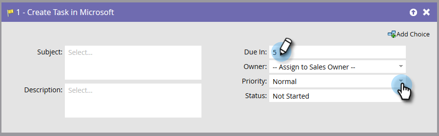

# Aufgabe in Microsoft erstellen {#create-task-in-microsoft}

Als Marketing-Experte verfügen Sie über Informationen, die dem Vertrieb beim Abschluss von Geschäften helfen können. Sie können Aufgaben erstellen, um ihnen mitzuteilen, was sie tun und wann sie es tun sollten.

Aufgabe erstellen in Microsoft erstellt eine Aufgabe unter Aktivitäten, die sich auf die Person (Lead oder Kontakt) in beziehen [!DNL Microsoft].

>[!NOTE]
>
>Dieser Flussschritt _funktioniert nur bei Verwendung mit Triggern_, nicht Filter, in Ihrer Smart-Kampagne verwenden.

Standardmäßig sieht der Flussschritt wie folgt aus:

>[!NOTE]
>
>Wenn der Marketo Sync User Aufgaben erstellt, **[!UICONTROL aufgrund von]** ist ein erforderliches Feld für die Aufgabe, die in [!DNL Microsoft]. Marketo gibt standardmäßig fünf Tage ein, wenn kein Wert eingegeben wird.

Passen Sie alle Felder an, um die Aufgabe wie gewünscht zu erstellen.

>[!NOTE]
>
>Das Feld &quot;Status&quot;, das für die Aufgabe in der Flussaktion angegeben ist, aktualisiert das Feld: &quot;Statusgrund&quot;in [!DNL Microsoft].

>[!TIP]
>
>Sie können `{{lead.tokens}}`, `{{company.tokens}}`, `{{campaign.tokens}}` und `{{system.tokens}}` im **[!UICONTROL Betreff]** und **[!UICONTROL Beschreibung]**. Siehe [Token für Flussschritte](/help/marketo/product-docs/core-marketo-concepts/smart-campaigns/flow-actions/use-tokens-in-flow-steps.md){target="_blank"} für weitere Details.
