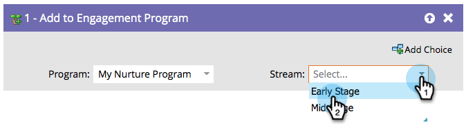

# Zu Engagement-Programm hinzufügen {#add-to-engagement-program}

Die intelligente Kampagne, die Sie mit diesem Flussschritt erstellen, ist das Tor zu Ihrem Interaktionsprogramm.

1. Wählen Sie das Interaktionsprogramm aus, dem Sie die Personen hinzufügen möchten.

   

1. Wählen Sie den Stream aus, in dem Sie die Personen platzieren möchten.

   

   >[!NOTE]
   >
   >Sie können eine Person nicht zu mehreren Streams innerhalb desselben Programms hinzufügen.
