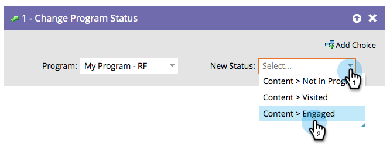

# Programmstatus ändern {#change-program-status}

Mit den Programmstatus können Sie verfolgen, wie Personen durch ein Programm oder eine Veranstaltung vorankommen. Weitere Informationen finden Sie unter [Anpassen, Erstellen und Verwalten von Kanälen](/help/marketo/product-docs/administration/tags/create-a-program-channel.md){target="_blank"}.

>[!CAUTION]
>
>Wenn Sie den Programmstatus in einem Interaktionsprogramm ändern, werden diese automatisch zum ersten Stream hinzugefügt. Sie erhalten Inhalte.

1. Ziehen Sie in den Flussschritt **[!UICONTROL Programmstatus ändern]** .

   

1. Wählen Sie den festzulegenden **[!UICONTROL neuen Status]** aus. Die Person wird auch Teil des Programms, wenn sie nicht bereits Teil des Programms war.

   

Die Auswahlmöglichkeiten sind auf gültige Status für dieses Programm beschränkt.

>[!NOTE]
>
>Eine Person kann nicht zu einem früheren Programmstatus zurückwechseln, der im Kanaleditor in Admin definiert ist.

Status sind leistungsstarke Werkzeuge, um Personen im Auge zu behalten und Berichte zu erstellen.
