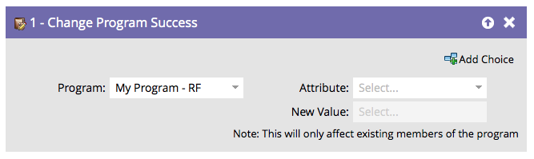

# Programmerfolg ändern {#change-program-success}

Wenn Sie eine Gruppe von Personen haben, die fälschlicherweise mit „Programm erfolgreich“ gekennzeichnet sind, können Sie diesen Flussschritt verwenden, um „Erfolg“ auf „true“ oder „false“ festzulegen.

1. Wenn Sie in diesem Flussschritt ziehen, wird das Programm automatisch auf das Programm eingestellt, das die Smart-Kampagne enthält, die Sie bearbeiten.

   >[!NOTE]
   >
   >Nur Mitglieder des Programms sind betroffen.

   

1. Wählen Sie **[!UICONTROL Erfolgsdatum]** oder **[!UICONTROL Erfolgsdatum]** als Attribut aus.

   

   >[!NOTE]
   >
   >Wenn Sie [!UICONTROL Erfolgsdatum] auf etwas festlegen, wird Erfolg automatisch auf „true“ gesetzt. Wenn [!UICONTROL Erfolg] auf „true“ gesetzt wird, wird automatisch das aktuelle Datum als Erfolgsdatum festgelegt.

1. Legen Sie den **[!UICONTROL Neuer Wert]** auf **[!UICONTROL True]** oder **[!UICONTROL False]**.

   

   >[!TIP]
   >
   >Sie können den Flussschritt zweimal verwenden, um sowohl das Erfolgs-Flag als auch das Datum festzulegen.

Sehr gut! Jetzt wissen Sie, wie Sie den Erfolg rückgängig machen und erzwingen können.
