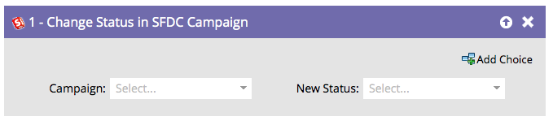

# Ändern des Status in SFDC-Kampagne {#change-status-in-sfdc-campaign}

In diesem Flussschritt können Sie den Mitgliedsstatus von Leads in der Salesforce-Kampagne ändern.

>[!NOTE]
>
>Nur verfügbar, wenn mit [!DNL Salesforce] integriert.

Wenn ein Lead in Salesforce nicht vorhanden ist oder noch nicht zur Kampagne gehört, wird er automatisch synchronisiert und der Salesforce-Kampagne mit dem entsprechenden Status hinzugefügt.

1. Suchen Sie zunächst nach der Salesforce **[!UICONTROL Kampagne), in]** der Datensatz enthalten ist, und wählen Sie sie aus.

   

1. Wählen Sie dann **[!UICONTROL Neuer Status]**, den Sie festlegen möchten, und Sie sind fertig!

   
