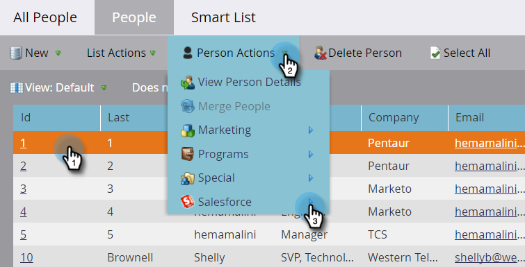

# Löschen von Personen aus SFDC {#delete-person-from-sfdc}

Wenn Sie einen bestimmten Satz von Leads aus Salesforce entfernen müssen, sie jedoch als Personen in Marketo Engage belassen, können Sie die Flussaktion Person aus SFDC löschen verwenden.

>[!NOTE]
>
>Nur verfügbar, wenn mit [!DNL Salesforce] integriert.

1. Klicken Sie in der Datenbank auf die Person, die Sie aus Salesforce entfernen möchten. Klicken Sie dann auf **[!UICONTROL Personenaktionen]** und wählen Sie **[!DNL Salesforce]** aus.

   

1. Wählen Sie **[!UICONTROL Person aus SFDC löschen]**.

   

1. Stellen Sie sicher, dass die Einstellung **[!UICONTROL Löschen in Marketo]** auf **[!UICONTROL false]** eingestellt ist, und klicken Sie dann auf **[!UICONTROL Jetzt ausführen]**.

   

   Nach Ausführung des Flussschritts ist Ihre Person kein Lead mehr in [!DNL Salesforce], sondern verbleibt in Marketo.

   >[!CAUTION]
   >
   >Wenn Sie **[!UICONTROL Löschen in Marketo]** auf **[!UICONTROL true]** setzen und die Personen aus Marketo und die Leads aus Salesforce löschen, sind diese unwiederbringlich verloren. Das kann nicht rückgängig gemacht werden.
