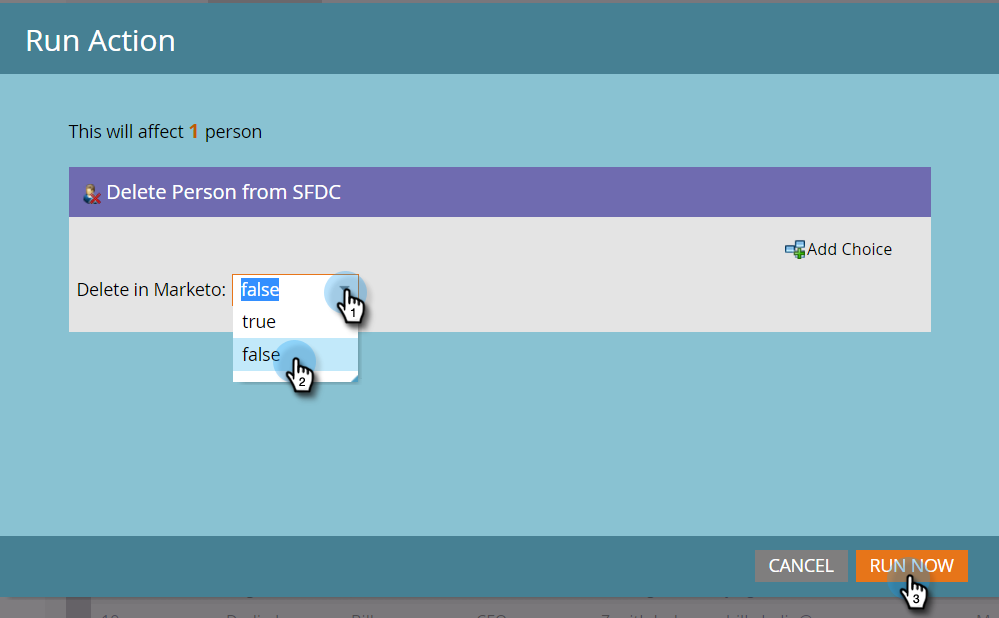

# Person aus SFDC löschen {#delete-person-from-sfdc}

Wenn Sie einen bestimmten Satz von Leads aus Salesforce entfernen müssen, diese jedoch als Personen im Marketo Engage belassen möchten, können Sie die Flusshandlung Person aus SFDC löschen verwenden.

>[!NOTE]
>
>Nur verfügbar bei Integration mit Salesforce.

1. Klicken Sie in der Datenbank auf die Person, die Sie aus Salesforce entfernen möchten. Klicken Sie dann auf **[!UICONTROL Personen-Aktionen]** und wählen Sie **[!DNL Salesforce]** aus.

   

1. Wählen Sie **[!UICONTROL Person aus SFDC löschen]** aus.

   

1. Stellen Sie sicher, dass die Einstellung **[!UICONTROL Löschen in Marketo]** den Wert **[!UICONTROL false]** aufweist, und klicken Sie dann auf **[!UICONTROL Jetzt ausführen]**.

   

   Nachdem der Flussschritt ausgeführt wurde, wird Ihre Person nicht mehr in Salesforce als Lead fungieren, sondern in Marketo bleiben.

   >[!CAUTION]
   >
   >Wenn Sie **[!UICONTROL Löschen in Marketo]** auf **[!UICONTROL true]** festlegen und die Personen aus Marketo und die Leads aus Salesforce löschen, sind sie für immer weg. Das kann nicht rückgängig gemacht werden.
