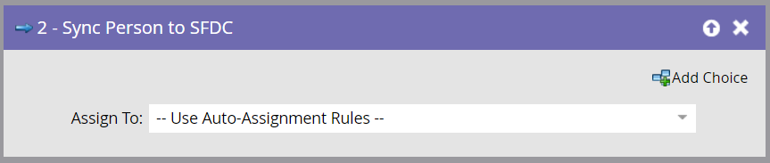

# Person mit SFDC synchronisieren {#sync-person-to-sfdc}

In diesem Flussschritt werden von Marketo erstellte Personen als Leads in Ihr Salesforce CRM eingefügt.

>[!NOTE]
>
>Nur verfügbar, wenn mit Salesforce integriert.

1. Standardmäßig werden diese Flussschritte den Lead-Inhabern auf der Grundlage der Salesforce-Regeln für die automatische Zuweisung zugewiesen.

   

   >[!TIP]
   >
   >Salesforce erfordert, dass die Person die Felder Firma und Nachname ausgefüllt hat. Andernfalls wird der Lead-Datensatz abgelehnt.

1. Sie können einen bestimmten Salesforce-Benutzer oder eine bestimmte Lead-Warteschlange als Lead-Inhaber festlegen.

   

   Bei Verwendung dieses Flussschritts wird die Person sofort als Salesforce-Lead synchronisiert und muss nicht auf die reguläre Synchronisierung warten.

   >[!CAUTION]
   >
   >Salesforce erlaubt nicht, „Kontakte“ Lead-Warteschlangen zuzuweisen. In diesem Fall erstellt Marketo ein doppeltes „Lead“ in Salesforce.
