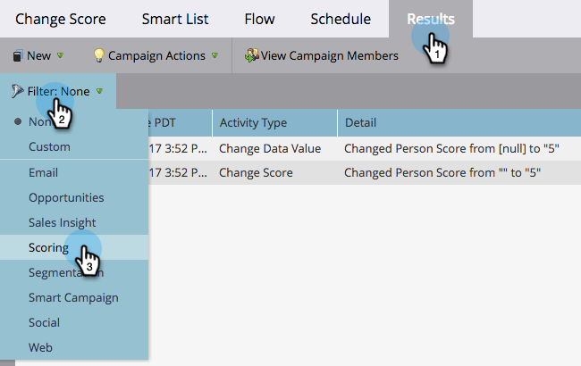
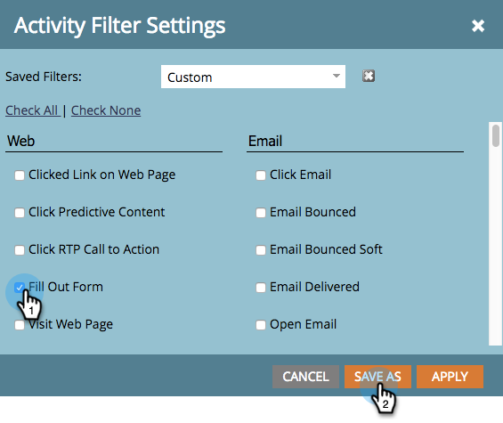

# Ergebnisse der Smart Campaign filtern {#filter-smart-campaign-results}

>[!PREREQUISITES]
>
>[Anzeigen der Ergebnisse von Smart Campaign](/help/marketo/product-docs/core-marketo-concepts/smart-campaigns/smart-campaign-data/view-smart-campaign-results.md)

Filtern Sie die Ergebnisse von Smart Campaign, um bestimmte Aktivitäten anzuzeigen, die für Sie wichtig sind.

## Nach gespeicherten Filtern {#filter-by-saved-filters}

1. Klicken Sie auf der Registerkarte **[!UICONTROL Ergebnisse]** der Smart-Kampagne auf **[!UICONTROL Filter]** und wählen Sie einen gespeicherten Filter aus.

   

   >[!NOTE]
   >
   >Standardmäßig sind keine Filter angewendet und die Ergebnisse zeigen alle Aktivitäten an.

## Erstellen eines benutzerdefinierten Filters {#create-a-custom-filter}

1. Klicken Sie **[!UICONTROL Filter]** und dann **[!UICONTROL Benutzerdefiniert]**.

   

1. Wählen Sie die gewünschten Aktivitätstypen aus und klicken Sie auf **[!UICONTROL Speichern unter]**.

   

   >[!TIP]
   >
   >Klicken Sie **[!UICONTROL Anwenden]**, um einen benutzerdefinierten Filter direkt auf Ihre Ergebnisse anzuwenden, ohne sie zu speichern.

1. Geben Sie einen Filternamen ein und klicken Sie auf **[!UICONTROL Speichern]**.

   

1. Der benutzerdefinierte Filter wird auf Ihre Ergebnisse angewendet und ist jetzt in der Dropdown-Liste verfügbar (Sie müssen möglicherweise die Seite aktualisieren, um sie in der Dropdown-Liste anzuzeigen).

   
