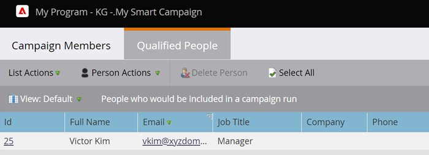

# Anzeigen der qualifizierten Personen in einer intelligenten Kampagne {#view-qualified-people-in-a-smart-campaign}

Personen anzeigen, die sich für den Fluss qualifizieren, wenn Sie eine intelligente Kampagne ausführen.

1. Klicken Sie in Ihrer Smart-Kampagne auf die Registerkarte **[!UICONTROL Zeitplan]** . Klicken Sie unter Smart-Listenstatus auf den ersten Link.

>[!NOTE]
>
>Trigger-Kampagnen zeigen keine qualifizierten Personen an, da sie auf Live-Ereignissen basieren.

1. Auf **[!UICONTROL Registerkarte]** Qualifizierte Personen“ werden die Personen aufgelistet, die sich für den Fluss qualifizieren, wenn die Kampagne ausgeführt wird.

   

   >[!CAUTION]
   >
   >Die Liste Qualifizierte Personen berücksichtigt keine Personen, die blockiert sind oder ihre Kommunikationsbeschränkungen erreicht haben.

   >[!NOTE]
   >
   >Die Anzahl der qualifizierten Personen hängt auch von den Qualifizierungsregeln für Smart Campaign ab. Erfahren Sie, wie [Qualifizierungsregeln bearbeiten](/help/marketo/product-docs/core-marketo-concepts/smart-campaigns/using-smart-campaigns/edit-qualification-rules-in-a-smart-campaign.md){target="_blank"}.

Verwenden Sie diese Liste, um zu überprüfen, welche Personen den Fluss durchlaufen, bevor Sie eine intelligente Kampagne ausführen.

>[!MORELIKETHIS]
>
>* [Anzeigen von Smart-Kampagnenmitgliedern](/help/marketo/product-docs/core-marketo-concepts/smart-campaigns/smart-campaign-data/view-smart-campaign-members.md){target="_blank"}
>* [Blockierte Personen in einer Smart-Kampagne anzeigen](/help/marketo/product-docs/core-marketo-concepts/smart-campaigns/smart-campaign-data/view-blocked-people-in-a-smart-campaign.md){target="_blank"}
>* [Hinzufügen eines Flussschritts zu einer Smart-Kampagne](/help/marketo/product-docs/core-marketo-concepts/smart-campaigns/flow-actions/add-a-flow-step-to-a-smart-campaign.md){target="_blank"}
