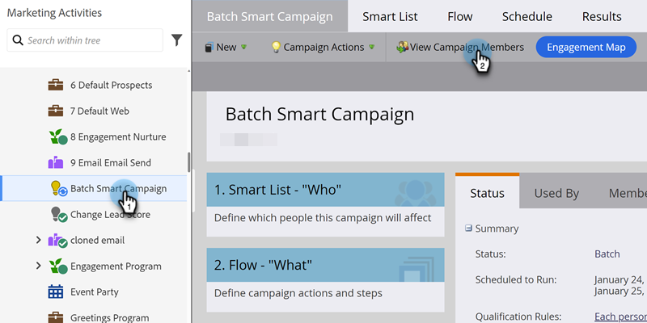

# Anzeigen von Smart Campaign-Mitgliedern {#view-smart-campaign-members}

Personen anzeigen, die den Fluss der intelligenten Kampagne bereits durchlaufen haben.

1. Navigieren Sie **[!UICONTROL Marketing-Aktivitäten]**.

   

1. Klicken Sie in Ihrer Smart-Kampagne auf **[!UICONTROL Kampagnenmitglieder anzeigen]**.

   

   >[!TIP]
   >
   >Sie können Kampagnenmitglieder von überall in einer Smart-Kampagne anzeigen.

1. Auf **[!UICONTROL Registerkarte]** Kampagnenmitglieder“ werden Personen angezeigt, die den Fluss der intelligenten Kampagne bereits durchlaufen haben.

   

   >[!NOTE]
   >
   >Die Liste der Kampagnenmitglieder ist zunächst leer, wenn die Smart-Kampagne auf keinem Benutzer ausgeführt wurde.

   >[!MORELIKETHIS]
   >
   >[Blockierte Personen in einer Smart-Kampagne anzeigen](/help/marketo/product-docs/core-marketo-concepts/smart-campaigns/smart-campaign-data/view-blocked-people-in-a-smart-campaign.md){target="_blank"}
