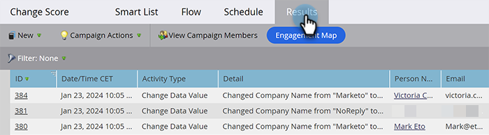

# Ergebnisse intelligenter Kampagnen anzeigen {#view-smart-campaign-results}

Möchten Sie eine Aufschlüsselung aller Ereignisse in einer Smart-Kampagne sehen? So geht es.

>[!TIP]
>
>Sie können die Liste der Personen anzeigen, die von der Smart-Kampagne verarbeitet wurden, indem Sie auf [Kampagnenmitglieder anzeigen](/help/marketo/product-docs/core-marketo-concepts/smart-campaigns/smart-campaign-data/view-smart-campaign-members.md){target="_blank"} klicken.

1. Klicken Sie in Ihrer Smart-Kampagne auf **[!UICONTROL Ergebnisse]**.

   

   >[!TIP]
   >
   >Sie können die Ergebnisse auch nach Aktivitätstyp filtern. Erfahren Sie, wie Sie [Ergebnisse intelligenter Kampagnen filtern](/help/marketo/product-docs/core-marketo-concepts/smart-campaigns/smart-campaign-data/filter-smart-campaign-results.md){target="_blank"}.

1. Klicken Sie auf eine **[!UICONTROL ID]** , um weitere Details zu dieser Aktivität anzuzeigen.

   

   >[!TIP]
   >
   >Zeigen Sie die Personendetails an, indem Sie auf den Namen der Person klicken.

   Sehen Sie sich die Ergebnisse an, um zu sehen, was Ihre Kampagne tatsächlich getan hat, oder exportieren Sie einfach [Smart-Campaign-Ergebnisse in Excel](/help/marketo/product-docs/core-marketo-concepts/smart-campaigns/smart-campaign-data/export-smart-campaign-results-to-excel.md){target="_blank"}.

   >[!MORELIKETHIS]
   >
   >[Ergebnisse intelligenter Kampagnen filtern](/help/marketo/product-docs/core-marketo-concepts/smart-campaigns/smart-campaign-data/filter-smart-campaign-results.md){target="_blank"}
