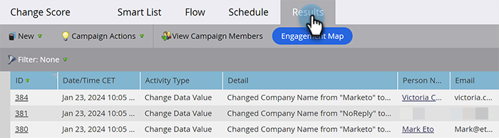

# Anzeigen der Ergebnisse einer intelligenten Kampagne {#view-smart-campaign-results}

Erfahren Sie, wie Sie die Ergebnisse Ihrer Smart-Kampagne anzeigen.

>[!TIP]
>
>Sie können die Liste der Personen anzeigen, die von der Smart-Kampagne verarbeitet wurden, indem Sie auf [Kampagnenmitglieder anzeigen](/help/marketo/product-docs/core-marketo-concepts/smart-campaigns/smart-campaign-data/view-smart-campaign-members.md){target="_blank"} klicken.

1. Klicken Sie in Ihrer Smart-Kampagne auf **[!UICONTROL Ergebnisse]**.

   

   >[!TIP]
   >
   >Sie können die Ergebnisse auch nach Aktivitätstyp filtern. Erfahren Sie, wie Sie [Ergebnisse von Smart Campaign filtern](/help/marketo/product-docs/core-marketo-concepts/smart-campaigns/smart-campaign-data/filter-smart-campaign-results.md){target="_blank"}.

1. Klicken Sie auf **[!UICONTROL ID]**, um weitere Details zu dieser bestimmten Aktivität anzuzeigen.

   

   >[!TIP]
   >
   >Zeigen Sie Personendetails an, indem Sie auf den Namen der Person klicken.

   Sehen Sie sich die Ergebnisse an, um zu sehen, was Ihre Kampagne tatsächlich getan hat, oder [exportieren Sie die Ergebnisse Ihrer Smart-Kampagne in Excel](/help/marketo/product-docs/core-marketo-concepts/smart-campaigns/smart-campaign-data/export-smart-campaign-results-to-excel.md){target="_blank"}.

   >[!MORELIKETHIS]
   >
   >[Filtern Sie intelligente Kampagnenergebnisse](/help/marketo/product-docs/core-marketo-concepts/smart-campaigns/smart-campaign-data/filter-smart-campaign-results.md){target="_blank"}
