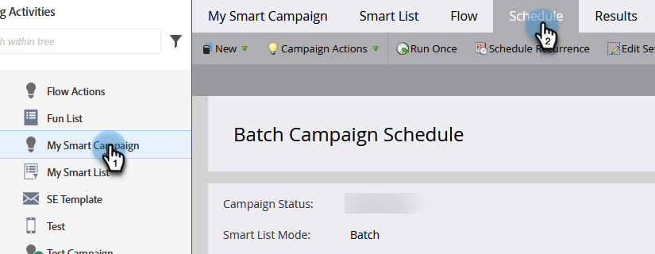

# Abbrechen einer Smart-Kampagne {#abort-a-smart-campaign}

>[!CAUTION]
>
>Nur für Notfälle

Manchmal starten Sie eine Smart-Kampagne und erkennen sofort, dass dies ein Fehler war. Hier erfahren Sie, wie Sie die Notbremse ziehen und die Smart-Campaign-Ausführung stoppen.

1. Wählen Sie die gewünschte Smart-Kampagne aus und klicken Sie auf die Registerkarte **[!UICONTROL Plan]** .

   

1. Klicken Sie auf das Dropdown-Menü **[!UICONTROL Kampagnenaktionen]** . Wählen Sie **[!UICONTROL Kampagnen abbrechen]** aus.

   

1. Klicken Sie zur Bestätigung auf **[!UICONTROL Abbruch]** .

   

   >[!NOTE]
   >
   >Durch Abbruch werden die bereits abgeschlossenen Schritte nicht rückgängig gemacht, sondern nur die Durchführung weiterer Schritte verhindert (z. B.: E-Mails können nicht rückgängig gemacht werden).

   

   >[!NOTE]
   >
   >Sehen Sie sich die Registerkarte **[!UICONTROL Ergebnisse]** der Smart-Kampagne an, um zu sehen, welche Aktionen vor dem Abbruch durchgeführt wurden. Außerdem finden Sie eine [Benachrichtigung](/help/marketo/product-docs/core-marketo-concepts/miscellaneous/understanding-notifications.md){target="_blank"} mit zusätzlichen Details.

   >[!TIP]
   >
   >Möchten Sie eine Person aus dem Fluss in einer Trigger-Kampagne entfernen? Sehen Sie sich [Aus Fluss entfernen](/help/marketo/product-docs/core-marketo-concepts/smart-campaigns/flow-actions/remove-from-flow.md){target="_blank"} an.

Überprüfen Sie immer Ihre Arbeit, aber diese Notbremse kann praktisch sein.
