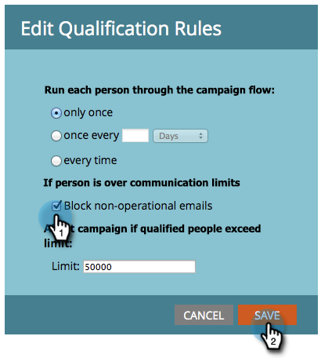

# Kommunikationsbeschränkungen auf intelligente Kampagne anwenden {#apply-communication-limits-to-smart-campaign}

>[!PREREQUISITES]
>
>[Kommunikationsbeschränkungen aktivieren](/help/marketo/product-docs/administration/email-setup/enable-communication-limits.md)

Es ist nicht gut, jemanden mehrere Male am Tag oder zu oft in einer Woche per E-Mail zu schicken, nicht wahr? Glücklicherweise hat Marketo Kommunikationsbeschränkungen, um zu helfen. So funktionieren sie.

>[!NOTE]
>
>Wenn eine Person die festgelegten Kommunikationsgrenzen überschreitet, blockiert Marketo nicht operative E-Mails (operative E-Mails senden immer).

1. Klicken Sie in Ihrer intelligenten Kampagne auf die Registerkarte **Plan** und dann **Einstellungen bearbeiten**.

   

1. Markieren Sie das Kontrollkästchen **Nicht operative E-Mails blockieren** und klicken Sie dann auf **Speichern**.

   

>[!NOTE]
>
>&quot;Grenze&quot;bezieht sich auf die Anzahl qualifizierter Personen, die eine intelligente Kampagne betreffen kann.

>[!TIP]
>
>Um dies als Standard festzulegen, bearbeiten Sie die [Kommunikationsbeschränkungen](/help/marketo/product-docs/administration/email-setup/enable-communication-limits.md) im Abschnitt &quot;Admin&quot;.

Süß. Jetzt können Sie sicher sein, dass Sie nicht versehentlich zu viele E-Mails an Ihre Audience senden.
